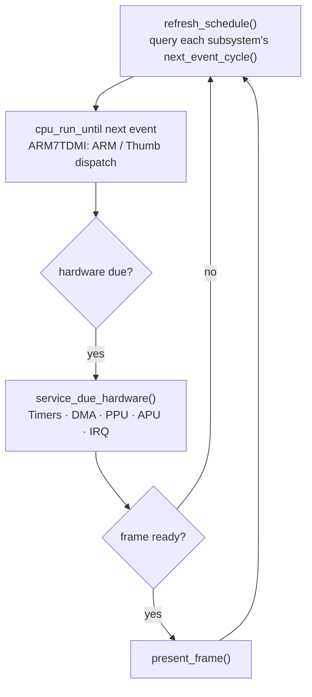

# gba-embedded


> A portable, cycle-scheduled Game Boy Advance emulator core in C++20 — from a desktop test bench to an ESP32-S3 handheld.

`gba-embedded` models the GBA as a hardware simulator driven by one master cycle
domain, not as a framebuffer app with a CPU bolted on. Every subsystem — the
ARM7TDMI core, memory bus, PPU, timers, DMA, IRQ controller, and Direct Sound
audio — advances against a single 16.78 MHz scheduler, so the same core runs
deterministically under host-side tests and on a microcontroller. The in-tree
embedded target is an **ESP32-S3** (Xtensa LX7, dual-core 240 MHz, octal PSRAM)
that drives an SPI LCD and I²S audio while the emulator core stays
platform-neutral.

This is an active bring-up project: bitmap video modes, CPU/DMA/timer timing,
and HLE BIOS are working; tile/sprite rendering and full DMA timing are still in
progress (see [Status](#-current-status)).

---

## ✨ Features

- **Cycle-scheduled core.** One master GBA cycle counter (16,777,216 Hz; 1232 cycles/scanline; 228 scanlines/frame; 280,896 cycles/frame) drives every subsystem. The CPU runs only until the next scheduled hardware event, then timers, DMA, PPU, APU, and IRQ are serviced at the exact cycle boundary.
- **ARM7TDMI interpreter.** Switch-dispatched ARM and Thumb execution with banked registers, all 15 CPSR conditions, exception entry/return, and per-instruction cycle accounting including bus timing.
- **Accurate memory bus.** Full GBA memory map with waitstate-aware GamePak reads, an 8-halfword prefetch buffer, BIOS pipeline-latch protection, and the real VRAM/palette/OAM byte-write rules.
- **PPU with an embedded render path.** Bitmap modes 3/4/5 and text backgrounds, plus a direct 128×128 center-crop render mode that writes straight into a PSRAM framebuffer for the ESP32-S3.
- **Timers, DMA, IRQ, Direct Sound.** Four timers with cascade, four DMA channels with immediate/HBlank/VBlank triggers, an IME/IE/IF interrupt controller with keypad IRQ, and timer-driven FIFO A/B audio.
- **HLE BIOS.** 13 SWIs (0x00–0x0D) always available, plus 14 more (0x0E–0x19, 0x1F) when `GBA_ENABLE_HLE_BIOS=ON`. Auto-detects a stub vs. real BIOS and supports skip-BIOS boot straight to `0x08000000`.
- **Host validation toolchain.** CPU trace runner, GBA test-suite runner, frame runner, and a bug harness — plus optional SDL2 and mGBA reference frontends — for differential testing against real emulators.
- **No hot-path overhead.** No `std::function`, no virtual dispatch, and no per-instruction heap allocation in the interpreter or scheduler. On ESP32-S3, hot loops live in IRAM and large buffers in PSRAM.

---

## 🧱 How it works

The emulator is organized as one master loop. Each iteration asks every
subsystem when its next event falls due, runs the CPU until that cycle, then
services all hardware at the precise boundary. This keeps all timing decisions
in one place and is what makes the core portable across very different hosts.



The scheduler is a fixed six-slot array (`Ppu`, `Timers`, `Dma`, `Apu`, `Serial`,
`Irq`) — no heap, no dynamic queue. `Emulator` owns every subsystem; `Bus`
receives references to the PPU, timers, DMA, APU, and IRQ for MMIO routing, and
the CPU receives the bus and IRQ controller. Deeper design notes live in
[docs/architecture.md](docs/architecture.md) and
[docs/component-roadmap.md](docs/component-roadmap.md).

---

## 📦 Installation

### Prerequisites

| Requirement | Version | Notes |
|---|---|---|
| C++ compiler | C++20 | Clang, GCC, or MSVC |
| CMake | ≥ 3.25 | |
| Python | 3.x | only for the diff/validation scripts |

For the **ESP32-S3 target** you also need Espressif **ESP-IDF v5.5.2** with the
`esp32s3` toolchain (see
[docs/esp32s3-build-flash-qemu-guide.md](docs/esp32s3-build-flash-qemu-guide.md)).
For the **optional SDL2 frontend**, install SDL2 development files (auto-detected
via `pkg-config`; skipped if absent).

### Desktop (host) build

```bash
cmake -S . -B build
cmake --build build
```

This produces the `gba_core` static library, the `gba_tests` executable, and the
host tools (`gba_trace_runner`, `gba_suite_runner`, `gba_alyosha_runner`,
`gba_frame_runner`, `gba_bug_harness`).

### ESP32-S3 build

The ESP32-S3 firmware is a separate ESP-IDF project under `platform/esp32s3/`.
From a shell with the IDF environment sourced:

```bash
cd platform/esp32s3
idf.py set-target esp32s3
idf.py build
```

Select between the display test, the playable runtime, and the QEMU smoke
firmware with the `GBA_BUILD_DISPLAY_TEST` / `GBA_BUILD_RUNTIME` CMake cache
variables (see [Configuration](#-configuration)).

---

## 🚀 Usage

### Run the deterministic host tests

```bash
ctest --test-dir build --output-on-failure
```

Expected output on success:

```text
1/1 Test #1: gba_tests ........................   Passed
All tests passed
```

The suite covers scheduler timing, bus address decoding and open-bus behavior,
ARM/Thumb instruction semantics and flags, PPU mode-3/4/5 framebuffer hashing,
timer/DMA/IRQ triggers, Direct Sound FIFO cadence, and keypad IRQ.

### Validate the CPU against a reference trace

Record your emulator's execution alongside a reference emulator's trace, then
diff them field by field:

```bash
./build/gba_trace_runner --rom game.gba --bios bios.bin --steps 100000 --output trace_actual.csv
python3 tools/compare_traces.py --expected trace_ref.csv --actual trace_actual.csv --ignore-field cycle
```

The optional `gba_mgba_ref_harness` (built when mGBA development headers are
found) generates the reference trace directly from mGBA.

### Run a GBA test-suite ROM

```bash
./build/gba_suite_runner
```

Parse and compare the resulting logs with
`tools/parse_gba_suite_logs.py`. Current suite-by-suite status is tracked in
[Status](#-current-status).

### Flash to an ESP32-S3

With a board connected over USB (e.g. an ESP32-S3-WROOM-1-N8R8 with octal PSRAM,
ST7735 or SSD1355 display, MAX98357A audio, and an SD card):

```bash
idf.py -B build_runtime -p /dev/cu.usbmodem21301 flash monitor
```

The runtime mounts the SD card, shows a ROM picker for `*.gba` files in the
root, auto-detects the save type, and boots — through a real BIOS if one is
present at `/gba_bios.bin`, otherwise via skip-BIOS. Full wiring and build-flag
details are in [docs/esp32s3-runtime.md](docs/esp32s3-runtime.md).

---

## ⚙️ Configuration

### Core CMake options

| Option | Default | Description |
|---|---|---|
| `GBA_BUILD_TESTS` | `ON` | Build the `gba_tests` host test executable |
| `GBA_BUILD_TOOLS` | `ON` | Build the host tools (trace/suite/frame runners, bug harness, SDL2 + mGBA frontends if available) |
| `GBA_ENABLE_HLE_BIOS` | `ON` | Compile in the full HLE BIOS SWI implementations (0x0E–0x19, 0x1F); only cycle-advance stubs remain when `OFF` |
| `GBA_WARNINGS_AS_ERRORS` | `OFF` | Treat compiler warnings as errors |

Strict warnings are always on for the core: `-Wall -Wextra -Wpedantic -Wshadow
-Wconversion -Wsign-conversion -Wdouble-promotion -Wformat=2` (Clang/GCC) or
`/W4 /permissive-` (MSVC).

### ESP32-S3 board profile

`platform/esp32s3/main/CMakeLists.txt` exposes a large set of `GBA_*` build
defines so a board can be configured without editing source. Pass them as `-D`
flags to `idf.py`. The commonly overridden ones:

| Define | Purpose |
|---|---|
| `GBA_BUILD_RUNTIME` / `GBA_BUILD_DISPLAY_TEST` | Select playable runtime vs. display hardware test vs. QEMU smoke firmware |
| `GBA_DISPLAY_DRIVER` | `1` = ST7735 (128×128, 26 MHz), `2` = SSD1351 (128×96, 8 MHz) |
| `GBA_DISPLAY_PIN_*` | SPI display pin mapping (SCLK, MOSI, DC, CS, RST, BL) |
| `GBA_INPUT_PIN_*` | Active-low button GPIOs (A/B/Select/Start/DPad/L/R) |
| `GBA_AUDIO_PIN_*` | MAX98357A I²S pins (BCK, WS, DOUT) |
| `GBA_STORAGE_MODE` / `GBA_ROM_BACKEND` | SD card transport (SDSPI) and ROM provider (page-cached) |
| `GBA_SDSPI_PIN_*` | SD card SPI pin mapping |

The default profile targets an ESP32-S3 Super Mini with SSD1351; see
[platform/esp32s3/main/gba_board_profile.h](platform/esp32s3/main/gba_board_profile.h)
for the full map.

---

## 🗂️ Project layout

```
include/gba/core/     Public emulator core interfaces (emulator, bus, cpu, ppu, …)
include/gba/platform/ Platform abstraction (Platform base, ESP32 ROM provider)
src/core/             Emulator implementation (~3000-line CPU, ~970-line bus, …)
platform/esp32s3/     ESP-IDF firmware: dual-core runtime, SPI display, SD ROM cache
tests/                Host test suite + trace/suite runners
tools/                Validation scripts and host frontends (SDL2, mGBA, QEMU smoke)
docs/                 Design notes and bring-up guides
```

On ESP32-S3, the runtime splits work across both cores: **Core 1** runs the CPU
and the 128×128 downscale into a PSRAM back buffer; **Core 0** streams that
buffer to the LCD over chunked DMA SPI with ping-pong swap. The synchronization
contract and per-chunk SPI sequence are documented in
[platform/esp32s3/DISPLAY_PIPELINE.md](platform/esp32s3/DISPLAY_PIPELINE.md).

---

## 📈 Current status

The host test suite is the source of truth for core accuracy. As of the last
recorded run, the deterministic host tests pass, and against the `gba-suite`
CPU/timing ROMs these suites pass 100%: Memory, I/O read, Timing, Timer IRQ,
Shifter, Carry, Multiply-long, and BIOS math. Actively failing suites include
Timer count-up, DMA timing, SIO register/timing, and miscellaneous edge cases;
the Video suite is not yet scored. Tile/sprite rendering, windows, and blending
remain future work. See [docs/validation-playbook.md](docs/validation-playbook.md)
for how to reproduce these numbers.

---

## 🤝 Contributing

This is an in-development personal project and not yet seeking outside
contributions. If you fork it, the host test suite and the trace-diff workflow in
[docs/validation-playbook.md](docs/validation-playbook.md) are the fastest way to
check that a change preserves timing correctness.

## 📄 License

No license file is present in this repository. Under default copyright terms that
means **all rights are reserved** — the source is published for reading and
forking reference, but no license to copy, modify, or redistribute is granted
here. Add a `LICENSE` file (e.g. MIT, Apache-2.0) before relying on or
redistributing any of this code.
