# 4

# ARM Instruction Set

# This chapter describes the ARM instruction set.

4.1 Instruction Set Summary 4-2

4.2 The Condition Field 4-5

4.3 Branch and Exchange (BX) 4-6

4.4 Branch and Branch with Link (B, BL) 4-8

4.5 Data Processing 4-10

4.6 PSR Transfer (MRS, MSR) 4-17

4.7 Multiply and Multiply-Accumulate (MUL, MLA) 4-22

4.8 Multiply Long and Multiply-Accumulate Long (MULL,MLAL) 4-24

4.9 Single Data Transfer (LDR, STR) 4-26

4.10 Halfword and Signed Data Transfer 4-32

4.11 Block Data Transfer (LDM, STM) 4-37

4.12 Single Data Swap (SWP) 4-43

4.13 Software Interrupt (SWI) 4-45

4.14 Coprocessor Data Operations (CDP) 4-47

4.15 Coprocessor Data Transfers (LDC, STC) 4-49

4.16 Coprocessor Register Transfers (MRC, MCR) 4-53

4.17 Undefined Instruction 4-55

4.18 Instruction Set Examples 4-56

# 4.1 Instruction Set Summary

# 4.1.1 Format summary

The ARM instruction set formats are shown below.

<table><tr><td>3</td><td>3</td><td>2</td><td>2</td><td>2</td><td>2</td><td>2</td><td>2</td><td>2</td><td>2</td><td>2</td><td>1</td><td>1</td><td>1</td><td>1</td><td>1</td><td>1</td><td>1</td><td>1</td><td>1</td><td>9</td><td>8</td><td>7</td><td>6</td><td>5</td><td>4</td><td>3</td><td>2</td><td>1</td><td>0</td></tr><tr><td>1</td><td>0</td><td>9</td><td>8</td><td>7</td><td>6</td><td>5</td><td>4</td><td>3</td><td>2</td><td>1</td><td>0</td><td>9</td><td>8</td><td>7</td><td>6</td><td>5</td><td>4</td><td>3</td><td>2</td><td>1</td><td>0</td><td></td><td></td><td></td><td></td><td></td><td></td><td></td><td></td></tr></table>

<table><tr><td>Cond</td><td>0</td><td>0</td><td>I</td><td colspan="4">Opcode</td><td>S</td><td colspan="4">Rn</td><td colspan="4">Rd</td><td colspan="11">Operand 2</td></tr><tr><td>Cond</td><td>0</td><td>0</td><td>0</td><td>0</td><td>0</td><td>0</td><td>A</td><td>S</td><td colspan="4">Rd</td><td colspan="4">Rn</td><td colspan="4">Rs</td><td>1</td><td>0</td><td>0</td><td colspan="2">1</td><td colspan="2">Rm</td></tr><tr><td>Cond</td><td>0</td><td>0</td><td>0</td><td>0</td><td>1</td><td>U</td><td>A</td><td>S</td><td colspan="4">RdHi</td><td colspan="4">RdLo</td><td colspan="4">Rn</td><td>1</td><td>0</td><td>0</td><td colspan="2">1</td><td colspan="2">Rm</td></tr><tr><td>Cond</td><td>0</td><td>0</td><td>0</td><td>1</td><td>0</td><td>B</td><td>0</td><td>0</td><td colspan="4">Rn</td><td colspan="4">Rd</td><td>0</td><td>0</td><td>0</td><td>0</td><td>1</td><td>0</td><td>0</td><td colspan="2">1</td><td colspan="2">Rm</td></tr><tr><td>Cond</td><td>0</td><td>0</td><td>0</td><td>1</td><td>0</td><td>0</td><td>1</td><td>0</td><td>1</td><td>1</td><td>1</td><td>1</td><td>1</td><td>1</td><td>1</td><td>1</td><td>1</td><td>1</td><td>1</td><td>1</td><td>0</td><td>0</td><td>0</td><td colspan="2">1</td><td colspan="2">Rn</td></tr><tr><td>Cond</td><td>0</td><td>0</td><td>0</td><td>P</td><td>U</td><td>0</td><td>W</td><td>L</td><td colspan="4">Rn</td><td colspan="4">Rd</td><td>0</td><td>0</td><td>0</td><td>0</td><td>1</td><td>S</td><td>H</td><td colspan="2">1</td><td colspan="2">Rm</td></tr><tr><td>Cond</td><td>0</td><td>0</td><td>0</td><td>P</td><td>U</td><td>1</td><td>W</td><td>L</td><td colspan="4">Rn</td><td colspan="4">Rd</td><td colspan="4">Offset</td><td>1</td><td>S</td><td>H</td><td colspan="2">1</td><td colspan="2">Offset</td></tr><tr><td>Cond</td><td>0</td><td>1</td><td>I</td><td>P</td><td>U</td><td>B</td><td>W</td><td>L</td><td colspan="4">Rn</td><td colspan="4">Rd</td><td colspan="11">Offset</td></tr><tr><td>Cond</td><td>0</td><td>1</td><td>1</td><td colspan="20"></td><td>1</td><td colspan="2"></td><td></td></tr><tr><td>Cond</td><td>1</td><td>0</td><td>0</td><td>P</td><td>U</td><td>S</td><td>W</td><td>L</td><td colspan="4">Rn</td><td colspan="15">Register List</td></tr><tr><td>Cond</td><td>1</td><td>0</td><td>1</td><td>L</td><td colspan="23">Offset</td></tr><tr><td>Cond</td><td>1</td><td>1</td><td>0</td><td>P</td><td>U</td><td>N</td><td>W</td><td>L</td><td colspan="4">Rn</td><td colspan="4">CRd</td><td colspan="4">CP#</td><td colspan="7">Offset</td></tr><tr><td>Cond</td><td>1</td><td>1</td><td>1</td><td>0</td><td colspan="4">CP Opc</td><td colspan="4">CRn</td><td colspan="4">CRd</td><td colspan="4">CP#</td><td colspan="2">CP</td><td colspan="2">0</td><td colspan="3">CRm</td></tr><tr><td>Cond</td><td>1</td><td>1</td><td>1</td><td>0</td><td colspan="3">CP Opc</td><td>L</td><td colspan="4">CRn</td><td colspan="4">Rd</td><td colspan="4">CP#</td><td colspan="2">CP</td><td colspan="2">1</td><td colspan="3">CRm</td></tr><tr><td>Cond</td><td>1</td><td>1</td><td>1</td><td>1</td><td colspan="23">Ignored by processor</td></tr></table>

Data Processing / PSR Transfer

Multiply

Multiply Long

Single Data Swap

Branch and Exchange

Halfword Data Transfer: register offset

Halfword Data Transfer: immediate offset

Single Data Transfer

Undefined

Block Data Transfer

Branch

Coprocessor Data Transfer

Coprocessor Data Operation

Coprocessor Register Transfer

Software Interrupt

Figure 4-1: ARM instruction set formats

Note Some instruction codes are not defined but do not cause the Undefined instruction trap to be taken,for instancea Multiply instruction with bit 6 changed toa1.These instructions should notbe used,as their action may change in future ARM implementations.

# 4.1.2 Instruction summary

<table><tr><td>Mnemonic</td><td>Instruction</td><td>Action</td><td>See Section:</td></tr><tr><td>ADC</td><td>Add with carry</td><td>Rd := Rn + Op2 + Carry</td><td>4.5</td></tr><tr><td>ADD</td><td>Add</td><td>Rd := Rn + Op2</td><td>4.5</td></tr><tr><td>AND</td><td>AND</td><td>Rd := Rn AND Op2</td><td>4.5</td></tr><tr><td>B</td><td>Branch</td><td>R15 := address</td><td>4.4</td></tr><tr><td>BIC</td><td>Bit Clear</td><td>Rd := Rn AND NOT Op2</td><td>4.5</td></tr><tr><td>BL</td><td>Branch with Link</td><td>R14 := R15, R15 := address</td><td>4.4</td></tr><tr><td>BX</td><td>Branch and Exchange</td><td>R15 := Rn,T bit := Rn[0]</td><td>4.3</td></tr><tr><td>CDP</td><td>Coprocessor Data Processing</td><td>(Coprocessor-specific)</td><td>4.14</td></tr><tr><td>CMN</td><td>Compare Negative</td><td>CPSR flags := Rn + Op2</td><td>4.5</td></tr><tr><td>CMP</td><td>Compare</td><td>CPSR flags := Rn - Op2</td><td>4.5</td></tr><tr><td>EOR</td><td>Exclusive OR</td><td>Rd := (Rn AND NOT Op2)OR (op2 AND NOT Rn)</td><td>4.5</td></tr><tr><td>LDC</td><td>Load coprocessor from memory</td><td>Coprocessor load</td><td>4.15</td></tr><tr><td>LDM</td><td>Load multiple registers</td><td>Stack manipulation (Pop)</td><td>4.11</td></tr><tr><td>LDR</td><td>Load register from memory</td><td>Rd := (address)</td><td>4.9, 4.10</td></tr><tr><td>MCR</td><td>Move CPU register to coprocessor register</td><td>cRn := rRn {cRm}</td><td>4.16</td></tr><tr><td>MLA</td><td>Multiply Accumulate</td><td>Rd := (Rm * Rs) + Rn</td><td>4.7, 4.8</td></tr><tr><td>MOV</td><td>Move register or constant</td><td>Rd := Op2</td><td>4.5</td></tr><tr><td>MRC</td><td>Move from coprocessor register to CPU register</td><td>Rn := cRn {cRm}</td><td>4.16</td></tr><tr><td>MRS</td><td>Move PSR status/flags to register</td><td>Rn := PSR</td><td>4.6</td></tr><tr><td>MSR</td><td>Move register to PSR status/flags</td><td>PSR := Rm</td><td>4.6</td></tr><tr><td>MUL</td><td>Multiply</td><td>Rd := Rm * Rs</td><td>4.7, 4.8</td></tr><tr><td>MVN</td><td>Move negative register</td><td>Rd := 0xFFFFFFF EOR Op2</td><td>4.5</td></tr><tr><td>ORR</td><td>OR</td><td>Rd := Rn OR Op2</td><td>4.5</td></tr><tr><td>RSB</td><td>Reverse Subtract</td><td>Rd := Op2 - Rn</td><td>4.5</td></tr><tr><td>RSC</td><td>Reverse Subtract with Carry</td><td>Rd := Op2 - Rn - 1 + Carry</td><td>4.5</td></tr><tr><td>SBC</td><td>Subtract with Carry</td><td>Rd := Rn - Op2 - 1 + Carry</td><td>4.5</td></tr><tr><td>STC</td><td>Store coprocessor register to memory</td><td>address := CRn</td><td>4.15</td></tr><tr><td>STM</td><td>Store Multiple</td><td>Stack manipulation (Push)</td><td>4.11</td></tr><tr><td>STR</td><td>Store register to memory</td><td>:= Rd</td><td>4.9, 4.10</td></tr><tr><td>SUB</td><td>Subtract</td><td>Rd := Rn - Op2</td><td>4.5</td></tr><tr><td>SWI</td><td>Software Interrupt</td><td>OS call</td><td>4.13</td></tr><tr><td>SWP</td><td>Swap register with memory</td><td>Rd := [Rn], [Rn] := Rm</td><td>4.12</td></tr><tr><td>TEQ</td><td>Test bitwise equality</td><td>CPSR flags := Rn EOR Op2</td><td>4.5</td></tr><tr><td>TST</td><td>Test bits</td><td>CPSR flags := Rn AND Op2</td><td>4.5</td></tr></table>

Table 4-1: The ARM Instruction set

# 4.2 The Condition Field

In ARM state, all instructions are conditionally executed according to the state of the CPSR condition codes and the instruction’s condition field. This field (bits 31:28) determines the circumstances under which an instruction is to be executed. If the state of the C, N, Z and V flags fulfils the conditions encoded by the field, the instruction is executed, otherwise it is ignored.

There are sixteen possible conditions, each represented by a two-character suffix that can be appended to the instruction’s mnemonic. For example, a Branch (B in assembly language) becomes BEQ for "Branch if Equal", which means the Branch will only be taken if the Z flag is set.

In practice, fifteen different conditions may be used: these are listed in Table 4-2: Condition code summary. The sixteenth (1111) is reserved,and must not be used.

In the absence of a suffix, the condition field of most instructions is set to "Always" (sufix AL). This means the instruction will always be executed regardless of the CPSR condition codes.

<table><tr><td>Code</td><td>Suffix</td><td>Flags</td><td>Meaning</td></tr><tr><td>0000</td><td>EQ</td><td>Z set</td><td>equal</td></tr><tr><td>0001</td><td>NE</td><td>Z clear</td><td>not equal</td></tr><tr><td>0010</td><td>CS</td><td>C set</td><td>unsigned higher or same</td></tr><tr><td>0011</td><td>CC</td><td>C clear</td><td>unsigned lower</td></tr><tr><td>0100</td><td>MI</td><td>N set</td><td>negative</td></tr><tr><td>0101</td><td>PL</td><td>N clear</td><td>positive or zero</td></tr><tr><td>0110</td><td>VS</td><td>V set</td><td>overflow</td></tr><tr><td>0111</td><td>VC</td><td>V clear</td><td>no overflow</td></tr><tr><td>1000</td><td>HI</td><td>C set and Z clear</td><td>unsigned higher</td></tr><tr><td>1001</td><td>LS</td><td>C clear or Z set</td><td>unsigned lower or same</td></tr><tr><td>1010</td><td>GE</td><td>N equals V</td><td>greater or equal</td></tr><tr><td>1011</td><td>LT</td><td>N not equal to V</td><td>less than</td></tr><tr><td>1100</td><td>GT</td><td>Z clear AND (N equals V)</td><td>greater than</td></tr><tr><td>1101</td><td>LE</td><td>Z set OR (N not equal to V)</td><td>less than or equal</td></tr><tr><td>1110</td><td>AL</td><td>(ignored)</td><td>always</td></tr></table>

Table 4-2: Condition code summary

# 4.3 Branch and Exchange (BX)

This instruction is only executed if the condition is true. The various conditions are defined in Table 4-2: Condition code summary on page 4-5.

This instruction performs a branch by copying the contents of a general register, Rn, into the program counter, PC. The branch causes a pipeline flush and refill from the address specified by Rn. This instruction also permits the instruction set to be exchanged. When the instruction is executed, the value of Rn[0] determines whether the instruction stream will be decoded as ARM or THUMB instructions.

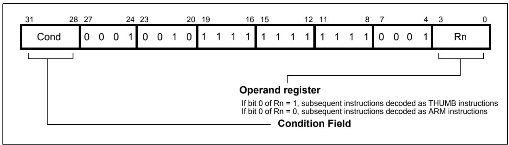

<details>
<summary>text_image</summary>

31 28 27 24 23 20 19 16 15 12 11 8 7 4 3 0
Cond 0 0 0 1 0 0 1 0 1 1 1 1 1 1 1 1 1 1 0 0 0 1 Rn
Operand register
If bit 0 of Rn = 1, subsequent instructions decoded as THUMB instructions
If bit 0 of Rn = 0, subsequent instructions decoded as ARM instructions
Condition Field
</details>

Figure 4-2: Branch and Exchange instructions

# 4.3.1 Instruction cycle times

The BX instruction takes 2S + 1N cycles to execute, where S and N are as defined in 6.2 Cycle Types on page 6-3.

# 4.3.2 Assembler syntax

BX - branch and exchange.

BX{cond} Rn

{cond} Two character condition mnemonic. See Table 4-2: Condition code summary on page 4-5.

Rn is an expression evaluating to a valid register number.

# 4.3.3 Using R15 as an operand

If R15 is used as an operand, the behaviour is undefined.

4.3.4 Examples   
```asm
ADR R0, Into_THUMB + 1; Generate branch target address
; and set bit 0 high - hence
; arrive in THUMB state.
BX R0 ; Branch and change to THUMB
; state.
CODE16 ; Assemble subsequent code as
Into_THUMB ; THUMB instructions
.
.
ADR R5, Back_to_ARM: Generate branch target to word
: aligned
address - hence bit 0
; is low and so change back to ARM
; state.
BX R5 ; Branch and change back to ARM
; state.
.
.
ALIGN ; Word align
CODE32 ; Assemble subsequent code as ARM
Back_to_ARM ; instructions 
```

# 4.4 Branch and Branch with Link (B, BL)

The instruction is only executed if the condition is true. The various conditions are defined Table 4-2: Condition code summary on page 4-5. The instruction encoding is shown in Figure 4-3: Branch instructions, below.

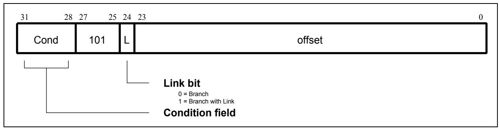

<details>
<summary>text_image</summary>

31 28 27 25 24 23 0
Cond 101 L offset
Link bit
0 = Branch
1 = Branch with Link
Condition field
</details>

Figure 4-3: Branch instructions

Branch instructions contain a signed 2’s complement 24 bit offset. This is shifted left two bits, sign extended to 32 bits, and added to the PC. The instruction can therefore specify a branch of +/- 32Mbytes. The branch offset must take account of the prefetch operation, which causes the PC to be 2 words (8 bytes) ahead of the current instruction.

Branches beyond +/- 32Mbytes must use an offset or absolute destination which has been previously loaded into a register. In this case the PC should be manually saved in R14 if a Branch with Link type operation is required.

# 4.4.1 The link bit

Branch with Link (BL) writes the old PC into the link register (R14) of the current bank. The PC value written into R14 is adjusted to allow for the prefetch, and contains the address of the instruction following the branch and link instruction. Note that the CPSR is not saved with the PC and R14[1:0] are always cleared.

To return from a routine called by Branch with Link use MOV PC,R14 if the link register is still valid or LDM Rn!,{..PC} if the link register has been saved onto a stack pointed to by Rn.

# 4.4.2 Instruction cycle times

Branch and Branch with Link instructions take 2S + 1N incremental cycles, where S and N are as defined in 6.2 Cycle Types on page 6-3.

# 4.4.3 Assembler syntax

Items in {} are optional. Items in <> must be present.

B{L}{cond} <expression>

{L} is used to request the Branch with Link form of the instruction. If absent, R14 will not be affected by the instruction.

{cond} is a two-character mnemonic as shown in Table 4-2: Condition code summary on page 4-5. If absent then AL (ALways) will be used.

<expression> is the destination. The assembler calculates the offset.

# 4.4.4 Examples

```txt
here BAL here ; assembles to 0xEAFFFFFFFE (note effect of PC offset).
B there ; Always condition used as default.
CMP R1,#0 ; Compare R1 with zero and branch to fred ; if R1 was zero, otherwise continue
BEQ fred ; continue to next instruction.
BL sub+ROM ; Call subroutine at computed address.
ADDS R1,#1 ; Add 1 to register 1, setting CPSR flags ; on the result then call subroutine if
BLCC sub ; the C flag is clear, which will be the ; case unless R1 held 0xFFFFFFFF. 
```

# 4.5 Data Processing

The data processing instruction is only executed if the condition is true. The conditions are defined in Table 4-2: Condition code summary on page 4-5.

The instruction encoding is shown in Figure 4-4: Data processing instructions below.

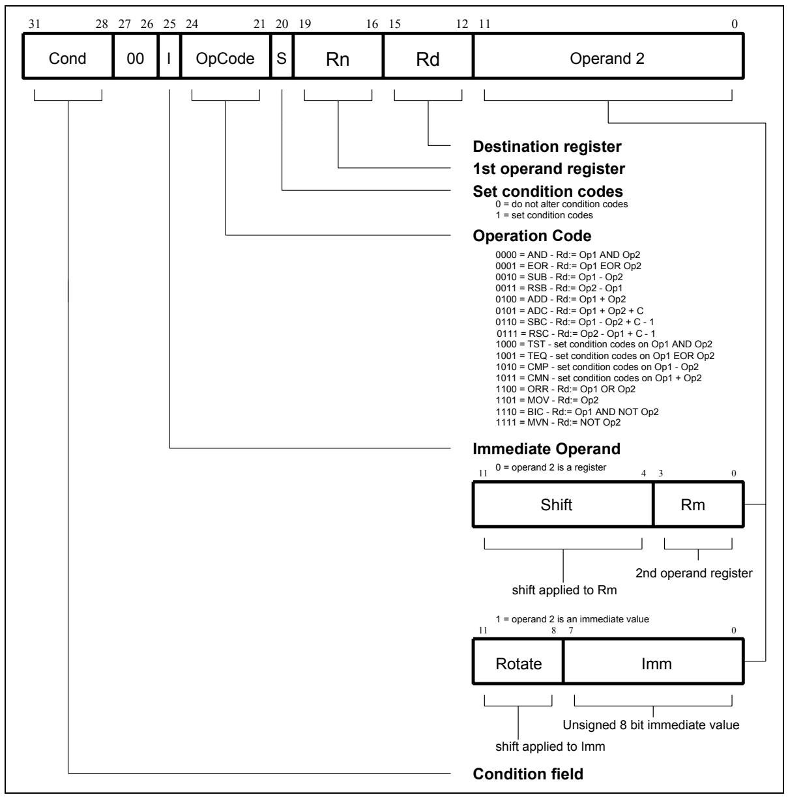

<details>
<summary>flowchart</summary>


```mermaid
graph TD
    A["Cond"] --> B["00"] --> C["I"] --> D["OpCode"] --> E["S"] --> F["Rn"] --> G["Rd"] --> H["Operand 2"]
    I["Destination register 1st operand register"] --> J["Set condition codes 0 = do not alter condition codes 1 = set condition codes"]
    K["Operation Code"] --> L["0000 = AND - Rd:= Op1 AND Op2"]
    K --> M["0001 = EOR - Rd:= Op1 EOR Op2"]
    K --> N["0010 = SUB - Rd:= Op1 - Op2"]
    K --> O["0011 = RSB - Rd:= Op2 - Op1"]
    K --> P["0100 = ADD - Rd:= Op1 + Op2"]
    K --> Q["0101 = ADC - Rd:= Op1 + Op2 + C"]
    K --> R["0110 = SBC - Rd:= Op1 - Op2 + C - 1"]
    K --> S["0111 = RSC - Rd:= Op2 - Op1 + C - 1"]
    K --> T["1000 = TST - set condition codes on Op1 AND Op2"]
    K --> U["1001 = TEQ - set condition codes on Op1 EOR Op2"]
    K --> V["1010 = CMP - set condition codes on Op1 - Op2"]
    K --> W["1011 = CMN - set condition codes on Op1 + Op2"]
    K --> X["1100 = ORR - Rd:= Op1 OR Op2"]
    K --> Y["1101 = MOV - Rd:= Op2"]
    K --> Z["1110 = BIC - Rd:= Op1 AND NOT Op2"]
    K --> AA["1111 = MVN - Rd:= NOT Op2"]
    AB["Immediate Operand"] --> AC["Shift"] --> AD["Rm"]
    AE["2nd operand register"] --> AF["shift applied to Rm"]
    AG["1 = operand 2 is an immediate value"] --> AH["Rotate"] --> AI["Imm"]
    AJ["Unsigned 8 bit immediate value"] --> AK["shift applied to Imm"]
    AL["Condition field"] --> AM["End"]
```
</details>

Figure 4-4: Data processing instructions

The instruction produces a result by performing a specified arithmetic or logical operation on one or two operands. The first operand is always a register (Rn).

The second operand may be a shifted register (Rm) or a rotated 8 bit immediate value (Imm) according to the value of the I bit in the instruction. The condition codes in the CPSR may be preserved or updated as a result of this instruction, according to the value of the S bit in the instruction.

Certain operations (TST, TEQ, CMP, CMN) do not write the result to Rd. They are used only to perform tests and to set the condition codes on the result and always have the S bit set. The instructions and their effects are listed in Table 4-3: ARM Data processing instructions.

# 4.5.1 CPSR flags

The data processing operations may be classified as logical or arithmetic. The logical operations (AND, EOR, TST, TEQ, ORR, MOV, BIC, MVN) perform the logical action on all corresponding bits of the operand or operands to produce the result. If the S bit is set (and Rd is not R15, see below) the V flag in the CPSR will be unaffected, the C flag will be set to the carry out from the barrel shifter (or preserved when the shift operation is LSL #0), the Z flag will be set if and only if the result is all zeros, and the N flag will be set to the logical value of bit 31 of the result .

<table><tr><td>Assembler Mnemonic</td><td>OpCode</td><td>Action</td></tr><tr><td>AND</td><td>0000</td><td>operand1 AND operand2</td></tr><tr><td>EOR</td><td>0001</td><td>operand1 EOR operand2</td></tr><tr><td>SUB</td><td>0010</td><td>operand1 - operand2</td></tr><tr><td>RSB</td><td>0011</td><td>operand2 - operand1</td></tr><tr><td>ADD</td><td>0100</td><td>operand1 + operand2</td></tr><tr><td>ADC</td><td>0101</td><td>operand1 + operand2 + carry</td></tr><tr><td>SBC</td><td>0110</td><td>operand1 - operand2 + carry - 1</td></tr><tr><td>RSC</td><td>0111</td><td>operand2 - operand1 + carry - 1</td></tr><tr><td>TST</td><td>1000</td><td>as AND, but result is not written</td></tr><tr><td>TEQ</td><td>1001</td><td>as EOR, but result is not written</td></tr><tr><td>CMP</td><td>1010</td><td>as SUB, but result is not written</td></tr><tr><td>CMN</td><td>1011</td><td>as ADD, but result is not written</td></tr><tr><td>ORR</td><td>1100</td><td>operand1 OR operand2</td></tr><tr><td>MOV</td><td>1101</td><td>operand2(operand1 is ignored)</td></tr><tr><td>BIC</td><td>1110</td><td>operand1 AND NOT operand2(Bit clear)</td></tr><tr><td>MVN</td><td>1111</td><td>NOT operand2(operand1 is ignored)</td></tr></table>

Table 4-3: ARM Data processing instructions

The arithmetic operations (SUB, RSB, ADD, ADC, SBC, RSC, CMP, CMN) treat each operand as a 32 bit integer (either unsigned or 2’s complement signed, the two are equivalent). If the S bit is set (and Rd is not R15) the V flag in the CPSR will be set if an overflow occurs into bit 31 of the result; this may be ignored if the operands were considered unsigned, but warns of a possible error if the operands were 2’s

complement signed. The C flag will be set to the carry out of bit 31 of the ALU, the Z flag will be set if and only if the result was zero, and the N flag will be set to the value of bit 31 of the result (indicating a negative result if the operands are considered to be 2’s complement signed).

# 4.5.2 Shifts

When the second operand is specified to be a shifted register, the operation of the barrel shifter is controlled by the Shift field in the instruction. This field indicates the type of shift to be performed (logical left or right, arithmetic right or rotate right). The amount by which the register should be shifted may be contained in an immediate field in the instruction, or in the bottom byte of another register (other than R15). The encoding for the different shift types is shown in Figure 4-5: ARM shift operations.

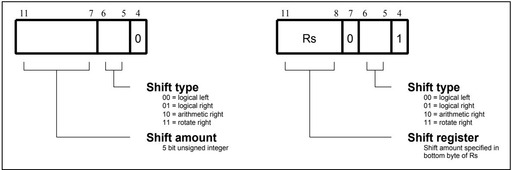

<details>
<summary>text_image</summary>

11 7 6 5 4
Shift type
00 = logical left
01 = logical right
10 = arithmetic right
11 = rotate right
Shift amount
5 bit unsigned integer
11 8 7 6 5 4
Rs 0 1
Shift register
Shift type
00 = logical left
01 = logical right
10 = arithmetic right
11 = rotate right
Shift amount specified in bottom byte of Rs
</details>

Figure 4-5: ARM shift operations

# Instruction specified shift amount

When the shift amount is specified in the instruction, it is contained in a 5 bit field which may take any value from 0—31. A logical shift left (LSL) takes the contents of Rm and moves each bit by the specified amount to a more significant position. The least significant bits of the result are filled with zeros, and the high bits of Rm which do not map into the result are discarded, except that the least significant discarded bit becomes the shifter carry output, which may be latched into the C bit of the CPSR when the ALU operation is in the logical class (see above). For example, the effect of f LSL #5 is shown in Figure 4-6: Logical shift left.

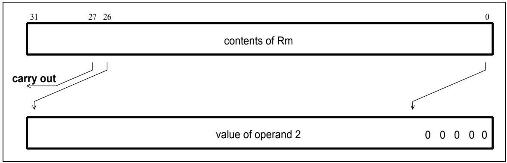

<details>
<summary>flowchart</summary>

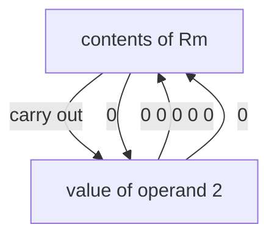
```mermaid
graph TD
    A["contents of Rm"] -->|carry out| B["value of operand 2"]
    B -->|0 0 0 0 0| A
    A -->|0| B
    B -->|0| A
```
</details>

Figure 4-6: Logical shift left

Note

LSL #0 is a special case, where the shifter carry out is the old value of the CPSR C flag. The contents of Rm are used directly as the second operand.

A logical shift right (LSR) is similar, but the contents of Rm are moved to less significant positions in the result. LSR #5 has the effect shown in Figure 4-7: Logical shift right.

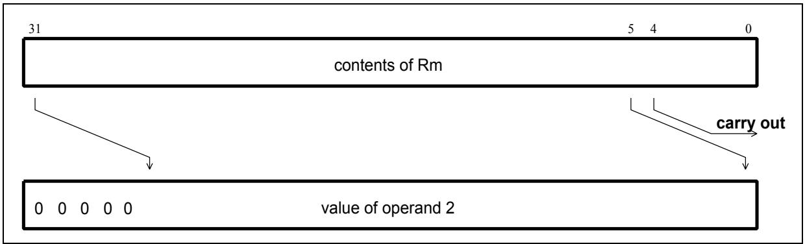

<details>
<summary>flowchart</summary>

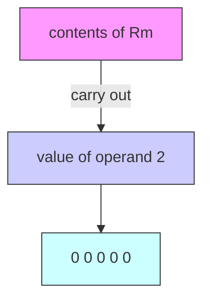
```mermaid
graph TD
    A["contents of Rm"] -->|carry out| B["value of operand 2"]
    B --> C["0 0 0 0 0"]
    style A fill:#f9f,stroke:#333
    style B fill:#ccf,stroke:#333
    style C fill:#cff,stroke:#333
```
</details>

Figure 4-7: Logical shift right

The form of the shift field which might be expected to correspond to LSR #0 is used to encode LSR #32, which has a zero result with bit 31 of Rm as the carry output. Logical shift right zero is redundant as it is the same as logical shift left zero, so the assembler will convert LSR #0 (and ASR #0 and ROR #0) into LSL #0, and allow LSR #32 to be specified.

An arithmetic shift right (ASR) is similar to logical shift right, except that the high bits are filled with bit 31 of Rm instead of zeros. This preserves the sign in 2’s complement notation. For example, ASR #5 is shown in Figure 4-8: Arithmetic shift right.

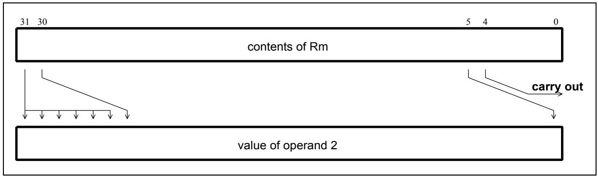

<details>
<summary>flowchart</summary>

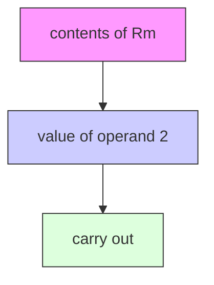
```mermaid
graph TD
    A["contents of Rm"] --> B["value of operand 2"]
    B --> C["carry out"]
    style A fill:#f9f,stroke:#333
    style B fill:#ccf,stroke:#333
    style C fill:#dfd,stroke:#333
```
</details>

Figure 4-8: Arithmetic shift right

The form of the shift field which might be expected to give ASR #0 is used to encode ASR #32. Bit 31 of Rm is again used as the carry output, and each bit of operand 2 is also equal to bit 31 of Rm. The result is therefore all ones or all zeros, according to the value of bit 31 of Rm.

Rotate right (ROR) operations reuse the bits which “overshoot” in a logical shift right operation by reintroducing them at the high end of the result, in place of the zeros used to fill the high end in logical right operations. For example, ROR #5 is shown in

Figure 4-9: Rotate right on page 4-13.

Figure 4-9: Rotate right

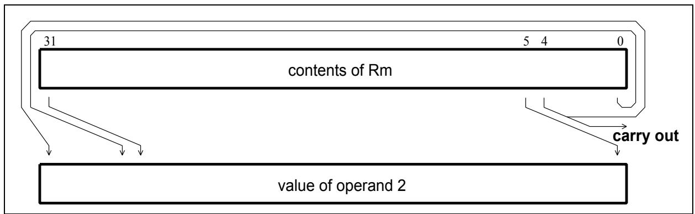

<details>
<summary>flowchart</summary>

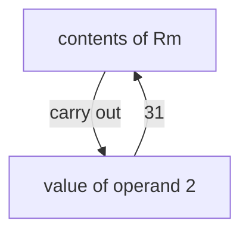
```mermaid
graph TD
    A["contents of Rm"] -->|carry out| B["value of operand 2"]
    B -->|31| A
```
</details>

The form of the shift field which might be expected to give ROR #0 is used to encode a special function of the barrel shifter, rotate right extended (RRX). This is a rotate right by one bit position of the 33 bit quantity formed by appending the CPSR C flag to the most significant end of the contents of Rm as shown in Figure 4-10: Rotate right extended.

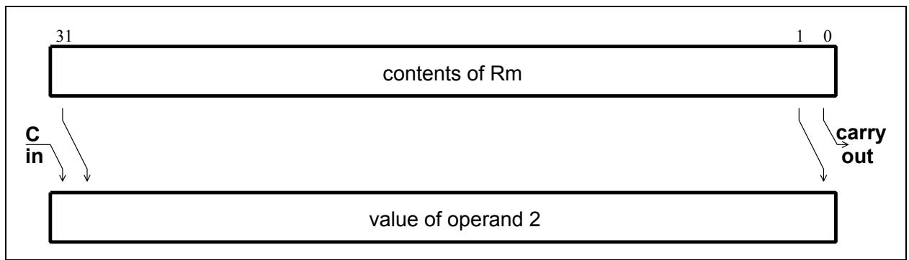

<details>
<summary>flowchart</summary>

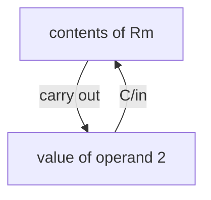
```mermaid
graph TD
    A["contents of Rm"] -->|carry out| B["value of operand 2"]
    B -->|C/in| A
```
</details>

Figure 4-10: Rotate right extended

# Register specified shift amount

Only the least significant byte of the contents of Rs is used to determine the shift amount. Rs can be any general register other than R15.

If this byte is zero, the unchanged contents of Rm will be used as the second operand, and the old value of the CPSR C flag will be passed on as the shifter carry output.

If the byte has a value between 1 and 31, the shifted result will exactly match that of an instruction specified shift with the same value and shift operation.

If the value in the byte is 32 or more, the result will be a logical extension of the shift described above:

1 LSL by 32 has result zero, carry out equal to bit 0 of Rm.   
2 LSL by more than 32 has result zero, carry out zero.   
3 LSR by 32 has result zero, carry out equal to bit 31 of Rm.   
4 LSR by more than 32 has result zero, carry out zero.   
5 ASR by 32 or more has result filled with and carry out equal to bit 31 of Rm.   
6 ROR by 32 has result equal to Rm, carry out equal to bit 31 of Rm.   
7 ROR by n where n is greater than 32 will give the same result and carry out as ROR by n-32; therefore repeatedly subtract 32 from n until the amount is in the range 1 to 32 and see above.

Note The zero in bit 7 of an instruction with a register controlled shift is compulsory; a one in thisbit willcause the instruction tobeamultiply orundefined instruction.

# 4.5.3 Immediate operand rotates

The immediate operand rotate field is a 4 bit unsigned integer which specifies a shift operation on the 8 bit immediate value. This value is zero extended to 32 bits, and then subject to a rotate right by twice the value in the rotate field. This enables many common constants to be generated, for example all powers of 2.

# 4.5.4 Writing to R15

When Rd is a register other than R15, the condition code flags in the CPSR may be updated from the ALU flags as described above.

When Rd is R15 and the S flag in the instruction is not set the result of the operation is placed in R15 and the CPSR is unaffected.

When Rd is R15 and the S flag is set the result of the operation is placed in R15 and the SPSR corresponding to the current mode is moved to the CPSR. This allows state changes which atomically restore both PC and CPSR. This form of instruction should not be used in User mode.

# 4.5.5 Using R15 as an operand

If R15 (the PC) is used as an operand in a data processing instruction the register is used directly.

The PC value will be the address of the instruction, plus 8 or 12 bytes due to instruction prefetching. If the shift amount is specified in the instruction, the PC will be 8 bytes ahead. If a register is used to specify the shift amount the PC will be 12 bytes ahead.

# 4.5.6 TEQ, TST, CMP and CMN opcodes

# Note

TEQ, TST, CMP and CMN do not write the result of their operation but do set flags in the CPSR. An assembler should always set the S flag for these instructions even if this is not specified in the mnemonic.

The TEQP form of the TEQ instruction used in earlier ARM processors must not be used: the PSR transfer operations should be used instead.

The action of TEQP in the ARM7TDMI-S is to move SPSR\_<mode> to the CPSR if the processor is in a privileged mode and to do nothing if in User mode.

# 4.5.7 Instruction cycle times

Data Processing instructions vary in the number of incremental cycles taken as follows:

<table><tr><td>Processing Type</td><td>Cycles</td></tr><tr><td>Normal Data Processing</td><td>1S</td></tr><tr><td>Data Processing with register specified shift</td><td>1S + 1I</td></tr><tr><td>Data Processing with PC written</td><td>2S + 1N</td></tr><tr><td>Data Processing with register specified shift and PC written</td><td>2S + 1N + 1I</td></tr></table>

Table 4-4: Incremental cycle times

S, N and I are as defined in 6.2 Cycle Types on page 6-3.

# 4.5.8 Assembler syntax

1 MOV,MVN (single operand instructions.)

<opcode>{cond}{S} Rd,<Op2>

```txt
2 CMP,CMN,TEQ,TST (instructions which do not produce a result.)
<opcode>{cond} Rn,<Op2>
3 AND,EOR,SUB,RSB,ADD,ADC,SBC,RSC,ORR,BIC
<opcode>{cond} {S} Rd,Rn,<Op2> 
```

where:   
```txt
<Op2> is Rm{,<shift>} or,<#expression>
{cond} is a two-character condition mnemonic. See Table 4-2: Condition code summary on page 4-5.
{S} set condition codes if S present (implied for CMP, CMN, TEQ, TST).
Rd, Rn and Rm are expressions evaluating to a register number.
<#expression> if this is used, the assembler will attempt to generate a shifted immediate 8-bit field to match the expression. If this is impossible, it will give an error.
<shift> is <shiftname> <register> or <shiftname> #expression, or RRX (rotate right one bit with extend).
<shiftname>s are: ASL, LSL, LSR, ASR, ROR. (ASL is a synonym for LSL, they assemble to the same code.) 
```

# 4.5.9 Examples

```txt
ADDEQR2, R4, R5 ; If the Z flag is set make R2:=R4+R5
TEQSR4, #3 ; test R4 for equality with 3.
; (The S is in fact redundant as the
; assembler inserts it automatically.)
SUBR4, R5, R7, LSR R2 ; Logical right shift R7 by the number in
; the bottom byte of R2, subtract result
; from R5, and put the answer into R4.
MOV PC, R14 ; Return from subroutine.
MOVSPC, R14 ; Return from exception and restore CPSR
; from SPSR_mode. 
```

# 4.6 PSR Transfer (MRS, MSR)

The instruction is only executed if the condition is true. The various conditions are defined in Table 4-2: Condition code summary on page 4-5.

The MRS and MSR instructions are formed from a subset of the Data Processing operations and are implemented using the TEQ, TST, CMN and CMP instructions without the S flag set. The encoding is shown in Figure 4-11: PSR transfer on page 4-18.

These instructions allow access to the CPSR and SPSR registers. The MRS instruction allows the contents of the CPSR or SPSR\_<mode> to be moved to a general register. The MSR instruction allows the contents of a general register to be moved to the CPSR or SPSR\_<mode> register.

The MSR instruction also allows an immediate value or register contents to be transferred to the condition code flags (N,Z,C and V) of CPSR or SPSR\_<mode> without affecting the control bits. In this case, the top four bits of the specified register contents or 32 bit immediate value are written to the top four bits of the relevant PSR.

# 4.6.1 Operand restrictions

In User mode, the control bits of the CPSR are protected from change, so only the condition code flags of the CPSR can be changed. In other (privileged) modes the entire CPSR can be changed.   
Note that the software must never change the state of the T bit in the CPSR. If this happens, the processor will enter an unpredictable state.   
The SPSR register which is accessed depends on the mode at the time of execution. For example, only SPSR\_fiq is accessible when the processor is in FIQ mode.   
You must not specify R15 as the source or destination register.   
Also, do not attempt to access an SPSR in User mode, since no such register exists.

MRS (transfer PSR contents to a register)   
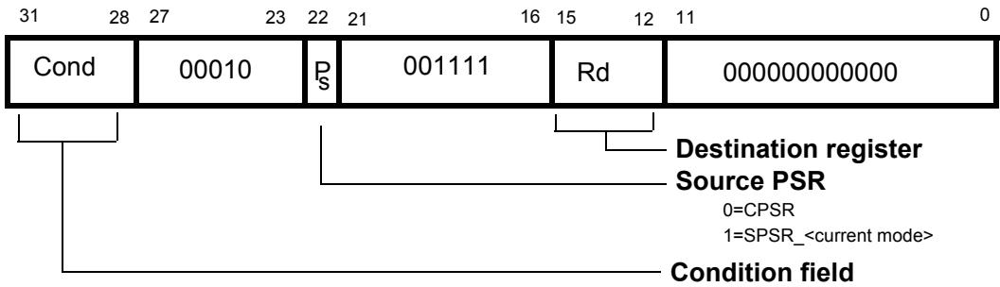

<details>
<summary>text_image</summary>

31 28 27 23 22 21 16 15 12 11 0
Cond 00010 Ps 001111 Rd 000000000000
Destination register
Source PSR
0=CPSR
1=SPSR_<current mode>
Condition field
</details>

MSR (transfer register contents to PSR)

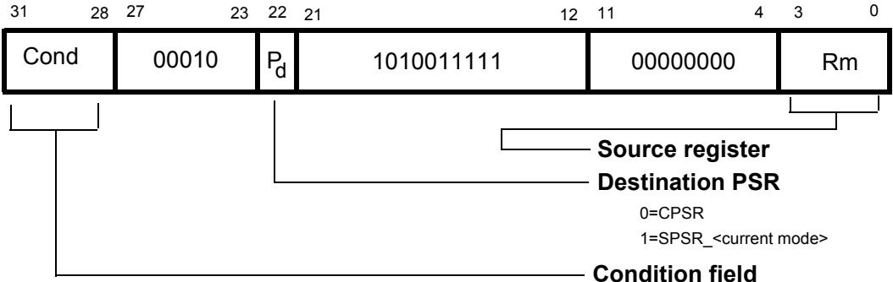

<details>
<summary>text_image</summary>

31 28 27 23 22 21 12 11 4 3 0
Cond 00010 Pd 1010011111 00000000 Rm
Source register
Destination PSR
0=CPSR
1=SPSR_<current mode>
Condition field
</details>

MSR (transfer register contents or immdiate value to PSR flag bits only)

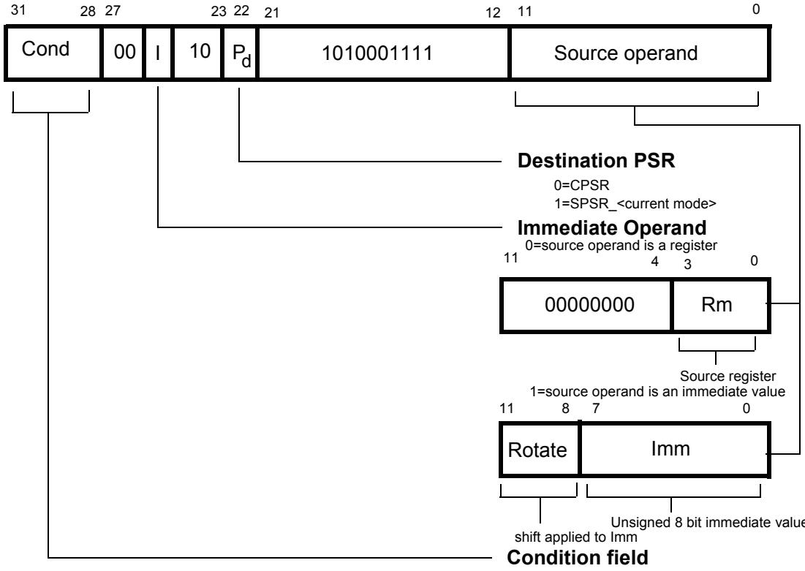

<details>
<summary>text_image</summary>

Cond	00_I	10	Pd	1010001111	Source operand
Destination PSR
0=CPSR
1=SPSR_<current mode>
Immediate Operand
0=source operand is a register
11	4	3	0
00000000	Rm
Source register
1=source operand is an immediate value
11	8	7	0
Rotate	Imm
Unsigned 8 bit immediate value
shift applied to Imm
Condition field
</details>

Figure 4-11: PSR transfer

# 4.6.2 Reserved bits

Only twelve bits of the PSR are defined in ARM7TDMI-S (N,Z,C,V,I,F, T & M[4:0]); the remaining bits are reserved for use in future versions of the processor. Refer to

Figure 3-6: Program status register format on page 3-12 for a full description of the PSR bits.

To ensure the maximum compatibility between ARM7TDMI-S programs and future processors, the following rules should be observed:

The reserved bits should be preserved when changing the value in a PSR.   
Programs should not rely on specific values from the reserved bits when checking the PSR status, since they may read as one or zero in future processors.

A read-modify-write strategy should therefore be used when altering the control bits of any PSR register; this involves transferring the appropriate PSR register to a general register using the MRS instruction, changing only the relevant bits and then transferring the modified value back to the PSR register using the MSR instruction.

# Example

The following sequence performs a mode change:

```asm
MRS R0, CPSR ; Take a copy of the CPSR.
BIC R0, R0, #0x1F ; Clear the mode bits.
ORR R0, R0, #new_mode ; Select new mode
MSR CPSR, R0 ; Write back the modified
; CPSR. 
```

When the aim is simply to change the condition code flags in a PSR, a value can be written directly to the flag bits without disturbing the control bits. The following instruction sets the N,Z,C and V flags:

```txt
MSRCPSR_flg,#0xF0000000 ; Set all the flags ; regardless of their ; previous state (does not ; affect any control bits). 
```

No attempt should be made to write an 8 bit immediate value into the whole PSR since such an operation cannot preserve the reserved bits.

# 4.6.3 Instruction cycle times

PSR Transfers take 1S incremental cycles, where S is as defined in 6.2 Cycle Types on page 6-3.

4.6.4 Assembler syntax   
```txt
1 MRS - transfer PSR contents to a register
MRS{cond} Rd, <psr>
2 MSR - transfer register contents to PSR
MSR{cond} <psr>, Rm
3 MSR - transfer register contents to PSR flag bits only
MSR{cond} <psrf>, Rm
The most significant four bits of the register contents are written to the N,Z,C & V flags respectively.
4 MSR - transfer immediate value to PSR flag bits only
MSR{cond} <psrf>, <#expression>
The expression should symbolise a 32 bit value of which the most significant four bits are written to the N,Z,C and V flags respectively. 
```

Key:   
```txt
{cond} two-character condition mnemonic. See Table 4-2: Condition code summary on page 4-5.
Rd and Rm are expressions evaluating to a register number other than R15
<psr> is CPSR, CPSR_all, SPSR or SPSR_all. (CPSR and CPSR_all are synonyms as are SPSR and SPSR_all)
<psrf> is CPSR_flg or SPSR_flg
<#expression> where this is used, the assembler will attempt to generate a shifted immediate 8-bit field to match the expression. If this is impossible, it will give an error. 
```

# 4.6.5 Examples

In User mode the instructions behave as follows:   
```txt
MSR CPSR_all, Rm ; CPSR[31:28] <- Rm[31:28]
MSR CPSR_flg, Rm ; CPSR[31:28] <- Rm[31:28]
MSR CPSR_flg, #0xA0000000; CPSR[31:28] <- 0xA
;(set N, C; clear Z, V)
MRS Rd, CPSR ; Rd[31:0] <- CPSR[31:0] 
```

In privileged modes the instructions behave as follows:   
```txt
MSRCPSR_all,Rm ; CPSR[31:0] <- Rm[31:0]
MSRCPSR_flg,Rm ; CPSR[31:28] <- Rm[31:28]
MSRCPSR_flg,#0x50000000; CPSR[31:28] <- 0x5
;(set Z,V; clear N,C)
MRS Rd,CPSR ; Rd[31:0] <- CPSR[31:0]
MSRSPSR_all,Rm ;SPSR_<mode>[31:0]<- Rm[31:0]
MSRSPSR_flg,Rm ; SPSR_<mode>[31:28] <- Rm[31:28]
MSRSPSR_flg,#0xC0000000; SPSR_<mode>[31:28] <- 0xC
;(set N,Z; clear C,V)
MRS Rd,SPSR ; Rd[31:0] <- SPSR_<mode>[31:0] 
```

# 4.7 Multiply and Multiply-Accumulate (MUL, MLA)

The instruction is only executed if the condition is true. The various conditions are defined in Table 4-2: Condition code summary on page 4-5. The instruction encoding is shown in Figure 4-12: Multiply instructions.

The multiply and multiply-accumulate instructions use an 8 bit Booth’s algorithm to perform integer multiplication.

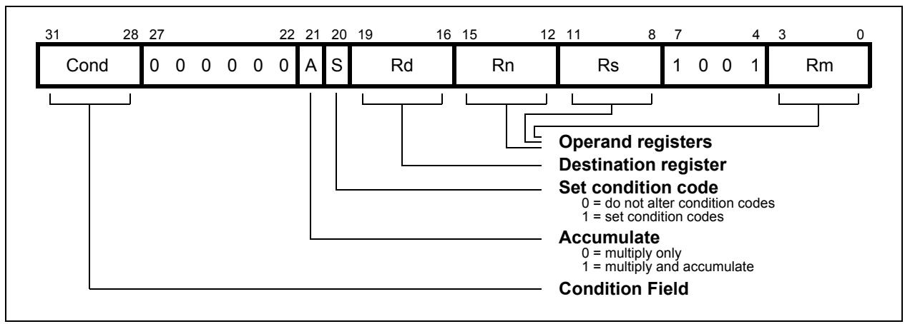

<details>
<summary>text_image</summary>

31 28 27 22 21 20 19 16 15 12 11 8 7 4 3 0
Cond 0 0 0 0 0 0 A S Rd Rn Rs 1 0 0 1 Rm
Operand registers
Destination register
Set condition code
0 = do not alter condition codes
1 = set condition codes
Accumulate
0 = multiply only
1 = multiply and accumulate
Condition Field
</details>

Figure 4-12: Multiply instructions

The multiply form of the instruction gives Rd:=Rm\*Rs. Rn is ignored, and should be set to zero for compatibility with possible future upgrades to the instruction set.

The multiply-accumulate form gives Rd:=Rm\*Rs+Rn, which can save an explicit ADD instruction in some circumstances.

Both forms of the instruction work on operands which may be considered as signed (2’s complement) or unsigned integers.

The results of a signed multiply and of an unsigned multiply of 32 bit operands differ only in the upper 32 bits - the low 32 bits of the signed and unsigned results are identical. As these instructions only produce the low 32 bits of a multiply, they can be used for both signed and unsigned multiplies.

For example consider the multiplication of the operands:

Operand AOperand BResult

0xFFFFFFF6 0x00000010xFFFFFF38

# If the operands are interpreted as signed

Operand A has the value -10, operand B has the value 20, and the result is -200 which is correctly represented as 0xFFFFFF38

# If the operands are interpreted as unsigned

Operand A has the value 4294967286, operand B has the value 20 and the result is 85899345720, which is represented as 0x13FFFFFF38, so the least significant 32 bits are 0xFFFFFF38.

# 4.7.1 Operand restrictions

The destination register Rd must not be the same as the operand register Rm. R15 must not be used as an operand or as the destination register.

All other register combinations will give correct results, and Rd, Rn and Rs may use the same register when required.

# 4.7.2 CPSR flags

Setting the CPSR flags is optional, and is controlled by the S bit in the instruction. The N (Negative) and Z (Zero) flags are set correctly on the result (N is made equal to bit 31 of the result, and Z is set if and only if the result is zero). The C (Carry) flag is set to a meaningless value and the V (oVerflow) flag is unaffected.

# 4.7.3 Instruction cycle times

MUL takes 1S + mI and MLA 1S + (m+1)I cycles to execute, where S and I are as defined in 6.2 Cycle Types on page 6-3.

<table><tr><td>m</td><td>is the number of 8 bit multiplier array cycles required to complete the multiply, which is controlled by the value of the multiplier operand specified by Rs. Its possible values are as follows</td></tr><tr><td>1</td><td>if bits [32:8] of the multiplier operand are all zero or all one.</td></tr><tr><td>2</td><td>if bits [32:16] of the multiplier operand are all zero or all one.</td></tr><tr><td>3</td><td>if bits [32:24] of the multiplier operand are all zero or all one.</td></tr><tr><td>4</td><td>in all other cases.</td></tr></table>

# 4.7.4 Assembler syntax

```txt
MUL{cond}{S} Rd, Rm, Rs
MLA{cond}{S} Rd, Rm, Rs, Rn 
```

<table><tr><td>{cond}</td><td>two-character condition mnemonic. SeeTable 4-2:Condition code summaryon page 4-5.</td></tr><tr><td>{S}</td><td>set condition codes if S present</td></tr><tr><td>Rd, Rm, Rs and Rn</td><td>are expressions evaluating to a register number other than R15.</td></tr></table>

# 4.7.5 Examples

```txt
MUL R1,R2,R3 ; R1:=R2*R3
MLAEQS R1,R2,R3,R4 ; Conditionally R1:=R2*R3+R4, ; setting condition codes. 
```

# 4.8 Multiply Long and Multiply-Accumulate Long (MULL,MLAL)

The instruction is only executed if the condition is true. The various conditions are defined in Table 4-2: Condition code summary on page 4-5. The instruction encoding is shown in Figure 4-13: Multiply long instructions.

The multiply long instructions perform integer multiplication on two 32 bit operands and produce 64 bit results. Signed and unsigned multiplication each with optional accumulate give rise to four variations.

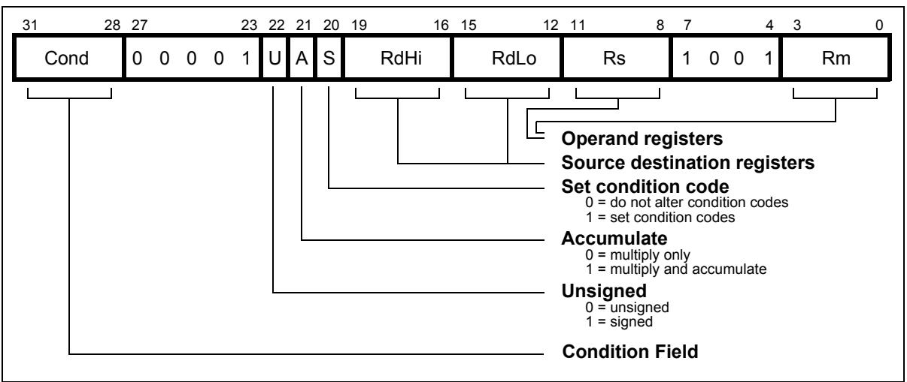

<details>
<summary>text_image</summary>

31 28 27 23 22 21 20 19 16 15 12 11 8 7 4 3 0
Cond 0 0 0 0 1 U A S RdHi RdLo Rs 1 0 0 1 Rm
Operand registers
Source destination registers
Set condition code
0 = do not alter condition codes
1 = set condition codes
Accumulate
0 = multiply only
1 = multiply and accumulate
Unsigned
0 = unsigned
1 = signed
Condition Field
</details>

Figure 4-13: Multiply long instructions

The multiply forms (UMULL and SMULL) take two 32 bit numbers and multiply them to produce a 64 bit result of the form RdHi,RdLo := Rm \* Rs. The lower 32 bits of the 64 bit result are written to RdLo, the upper 32 bits of the result are written to RdHi.

The multiply-accumulate forms (UMLAL and SMLAL) take two 32 bit numbers, multiply them and add a 64 bit number to produce a 64 bit result of the form RdHi,RdLo := Rm \* Rs + RdHi,RdLo. The lower 32 bits of the 64 bit number to add is read from RdLo. The upper 32 bits of the 64 bit number to add is read from RdHi. The lower 32 bits of the 64 bit result are written to RdLo. The upper 32 bits of the 64 bit result are written to RdHi.

The UMULL and UMLAL instructions treat all of their operands as unsigned binary numbers and write an unsigned 64 bit result. The SMULL and SMLAL instructions treat all of their operands as two’s-complement signed numbers and write a two’scomplement signed 64 bit result.

# 4.8.1 Operand restrictions

R15 must not be used as an operand or as a destination register.   
RdHi, RdLo, and Rm must all specify different registers.

# 4.8.2 CPSR flags

Setting the CPSR flags is optional, and is controlled by the S bit in the instruction. The N and Z flags are set correctly on the result (N is equal to bit 63 of the result, Z is set if and only if all 64 bits of the result are zero). Both the C and V flags are set to meaningless values.

# 4.8.3 Instruction cycle times

MULL takes 1S + (m+1)I and MLAL 1S + (m+2)I cycles to execute, where m is the number of 8 bit multiplier array cycles required to complete the multiply, which is controlled by the value of the multiplier operand specified by Rs.

Its possible values are as follows:

For signed instructions SMULL, SMLAL: 

<table><tr><td>1</td><td>if bits [31:8] of the multiplier operand are all zero or all one.</td></tr><tr><td>2</td><td>if bits [31:16] of the multiplier operand are all zero or all one.</td></tr><tr><td>3</td><td>if bits [31:24] of the multiplier operand are all zero or all one.</td></tr><tr><td>4</td><td>in all other cases.</td></tr></table>

For unsigned instructions UMULL, UMLAL: 

<table><tr><td>1</td><td>if bits [31:8] of the multiplier operand are all zero.</td></tr><tr><td>2</td><td>if bits [31:16] of the multiplier operand are all zero.</td></tr><tr><td>3</td><td>if bits [31:24] of the multiplier operand are all zero.</td></tr><tr><td>4</td><td>in all other cases.</td></tr></table>

S and I are as defined in 6.2 Cycle Types on page 6-3.

# 4.8.4 Assembler syntax

<table><tr><td>Mnemonic</td><td>Description</td><td>Purpose</td></tr><tr><td>UMULL{cond}{S} RdLo,RdHi,Rm,Rs</td><td>Unsigned Multiply Long</td><td>32 x 32 = 64</td></tr><tr><td>UMLAL{cond}{S} RdLo,RdHi,Rm,Rs</td><td>Unsigned Multiply &amp; Accumulate Long</td><td>32 x 32 + 64 = 64</td></tr><tr><td>SMULL{cond}{S} RdLo,RdHi,Rm,Rs</td><td>Signed Multiply Long</td><td>32 x 32 = 64</td></tr><tr><td>SMLAL{cond}{S} RdLo,RdHi,Rm,Rs</td><td>Signed Multiply &amp; Accumulate Long</td><td>32 x 32 + 64 = 64</td></tr></table>

Table 4-5: Assembler syntax descriptions

where:

<table><tr><td>{cond}</td><td>two-character condition mnemonic. SeeTable 4-2:Condition code summaryon page 4-5.</td></tr><tr><td>{S}</td><td>set condition codes if S present</td></tr><tr><td>RdLo, RdHi, Rm, Rs</td><td>are expressions evaluating to a register number other than R15.</td></tr></table>

# 4.8.5 Examples

<table><tr><td>UMULL</td><td>R1,R4,R2,R3</td><td>; R4,R1:=R2*R3</td></tr><tr><td>UMLALS</td><td>R1,R5,R2,R3</td><td>; R5,R1:=R2*R3+R5,R1 also setting</td></tr><tr><td></td><td></td><td>; condition codes</td></tr></table>

# 4.9 Single Data Transfer (LDR, STR)

The instruction is only executed if the condition is true. The various conditions are defined in Table 4-2: Condition code summary on page 4-5. The instruction encoding is shown in Figure 4-14: Single data transfer instructions.

The single data transfer instructions are used to load or store single bytes or words of data. The memory address used in the transfer is calculated by adding an offset to or subtracting an offset from a base register.

The result of this calculation may be written back into the base register if auto-indexing is required.

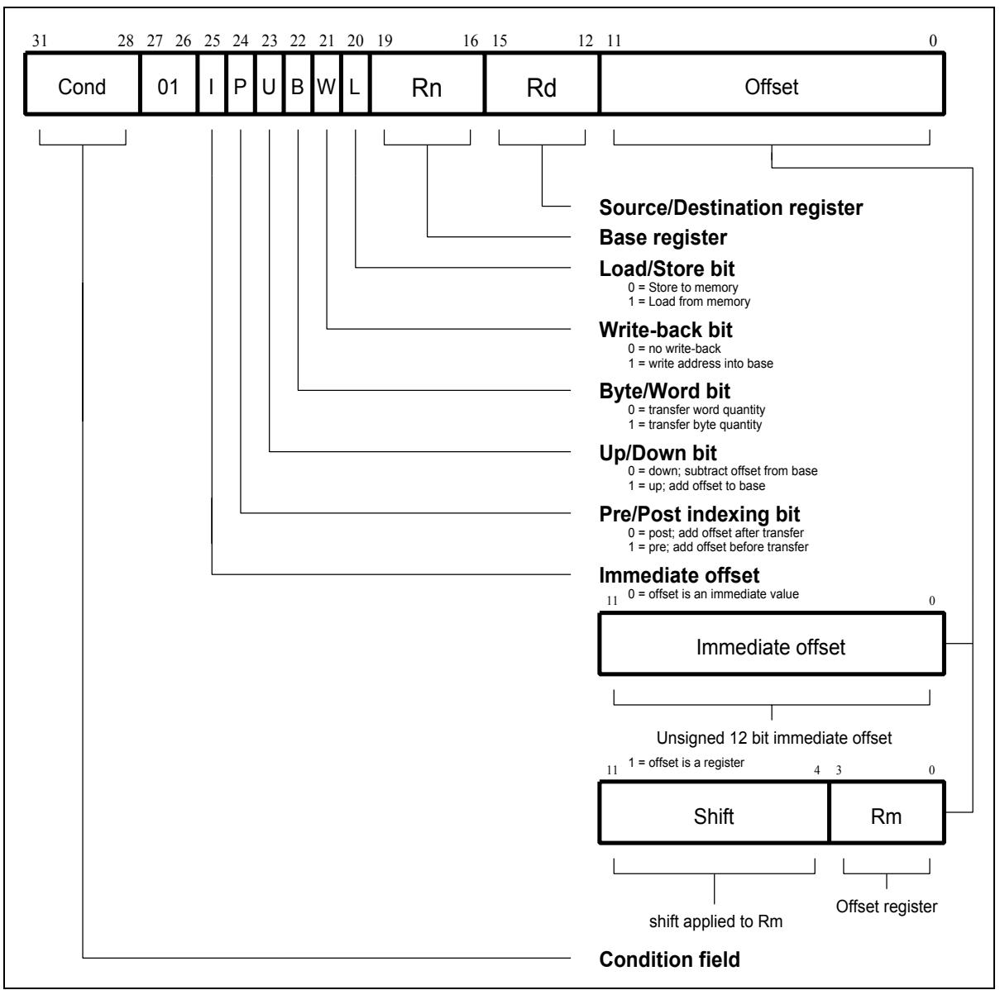

<details>
<summary>flowchart</summary>

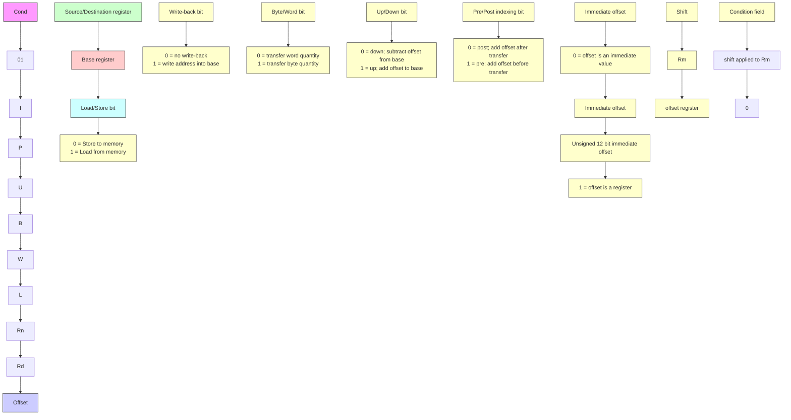
```mermaid
graph TD
    A["Cond"] --> B["01"]
    B --> C["I"]
    C --> D["P"]
    D --> E["U"]
    E --> F["B"]
    F --> G["W"]
    G --> H["L"]
    H --> I["Rn"]
    I --> J["Rd"]
    J --> K["Offset"]
    L["Source/Destination register"] --> M["Base register"]
    M --> N["Load/Store bit"]
    N --> O["0 = Store to memory\n1 = Load from memory"]
    P["Write-back bit"] --> Q["0 = no write-back\n1 = write address into base"]
    R["Byte/Word bit"] --> S["0 = transfer word quantity\n1 = transfer byte quantity"]
    T["Up/Down bit"] --> U["0 = down; subtract offset from base\n1 = up; add offset to base"]
    V["Pre/Post indexing bit"] --> W["0 = post; add offset after transfer\n1 = pre; add offset before transfer"]
    X["Immediate offset"] --> Y["0 = offset is an immediate value"]
    Y --> Z["Immediate offset"]
    Z --> AA["Unsigned 12 bit immediate offset"]
    AA --> AB["1 = offset is a register"]
    AC["Shift"] --> AD["Rm"]
    AD --> AE["offset register"]
    AF["Condition field"] --> AG["shift applied to Rm"]
    AG --> AH["0"]
    style A fill:#f9f,stroke:#333
    style K fill:#ccf,stroke:#333
    style L fill:#cfc,stroke:#333
    style M fill:#fcc,stroke:#333
    style N fill:#cff,stroke:#333
    style O fill:#ffc,stroke:#333
    style P fill:#ffc,stroke:#333
    style Q fill:#ffc,stroke:#333
    style R fill:#ffc,stroke:#333
    style S fill:#ffc,stroke:#333
    style T fill:#ffc,stroke:#333
    style U fill:#ffc,stroke:#333
    style V fill:#ffc,stroke:#333
    style W fill:#ffc,stroke:#333
    style X fill:#ffc,stroke:#333
    style Y fill:#ffc,stroke:#333
    style Z fill:#ffc,stroke:#333
    style AA fill:#ffc,stroke:#333
    style AB fill:#ffc,stroke:#333
    style AC fill:#ffc,stroke:#333
    style AD fill:#ffc,stroke:#333
    style AE fill:#ffc,stroke:#333
    style AF fill:#ffc,stroke:#333
```
</details>

Figure 4-14: Single data transfer instructions

# 4.9.1 Offsets and auto-indexing

The offset from the base may be either a 12 bit unsigned binary immediate value in the instruction, or a second register (possibly shifted in some way). The offset may be added to (U=1) or subtracted from (U=0) the base register Rn. The offset modification may be performed either before (pre-indexed, P=1) or after (post-indexed, P=0) the base is used as the transfer address.

The W bit gives optional auto increment and decrement addressing modes. The modified base value may be written back into the base (W=1), or the old base value may be kept (W=0). In the case of post-indexed addressing, the write back bit is redundant and must be set to zero, since the old base value can be retained by setting the offset to zero. Therefore post-indexed data transfers always write back the modified base. The only use of the W bit in a post-indexed data transfer is in privileged mode code, where setting the W bit forces non-privileged mode for the transfer, allowing the operating system to generate a user address in a system where the memory management hardware makes suitable use of this hardware.

# 4.9.2 Shifted register offset

The 8 shift control bits are described in the data processing instructions section. However, the register specified shift amounts are not available in this instruction class. See 4.5.2 Shifts on page 4-12.

# 4.9.3 Bytes and words

This instruction class may be used to transfer a byte (B=1) or a word (B=0) between an ARM7TDMI-S register and memory.

The action of LDR(B) and STR(B) instructions is influenced by the BIGEND control signal. The two possible configurations are described below.

# Little endian configuration

A byte load (LDRB) expects the data on data bus inputs 7 through 0 if the supplied address is on a word boundary, on data bus inputs 15 through 8 if it is a word address plus one byte, and so on. The selected byte is placed in the bottom 8 bits of the destination register, and the remaining bits of the register are filled with zeros. Please see Figure 3-2: Little-endian addresses of bytes within words on page 3-4.

A byte store (STRB) repeats the bottom 8 bits of the source register four times across data bus outputs 31 through 0. The external memory system should activate the appropriate byte subsystem to store the data.

A word load (LDR) will normally use a word aligned address. However, an address offset from a word boundary will cause the data to be rotated into the register so that the addressed byte occupies bits 0 to 7. This means that half-words accessed at offsets 0 and 2 from the word boundary will be correctly loaded into bits 0 through 15 of the register. Two shift operations are then required to clear or to sign extend the upper 16 bits. This is illustrated in Figure 4-15: Little endian offset addressing on page 4-28.

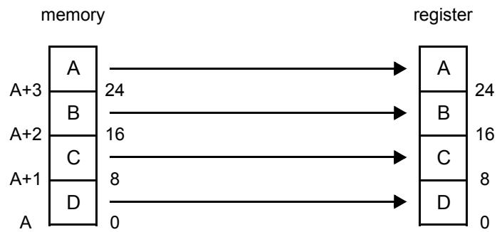

<details>
<summary>flowchart</summary>

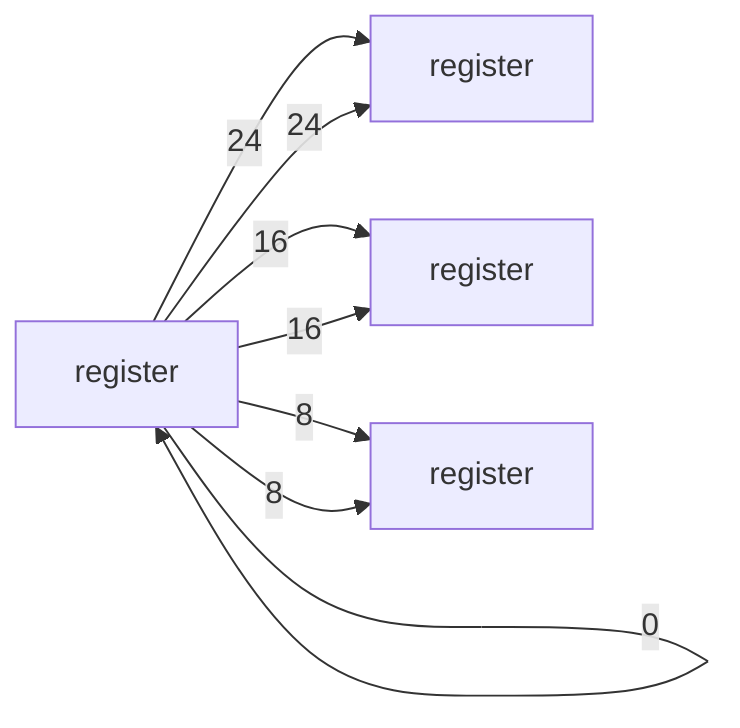
```mermaid
graph LR
    A[" memory "] -->|24| B[" register "]
    A[" memory "] -->|16| C[" register "]
    A[" memory "] -->|8| D[" register "]
    A[" memory "] -->|0| A[" register "]
    A[" memory "] -->|24| B[" register "]
    A[" register "] -->|16| C[" register "]
    A[" register "] -->|8| D[" register "]
```
</details>

LDR from word aligned address

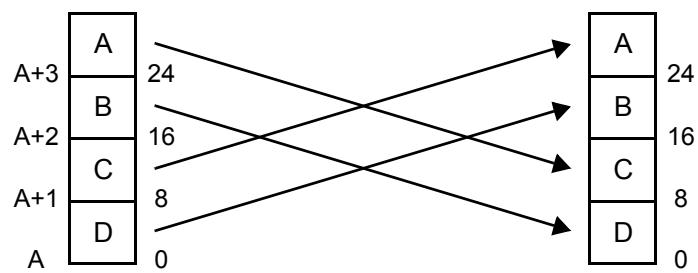

<details>
<summary>flowchart</summary>

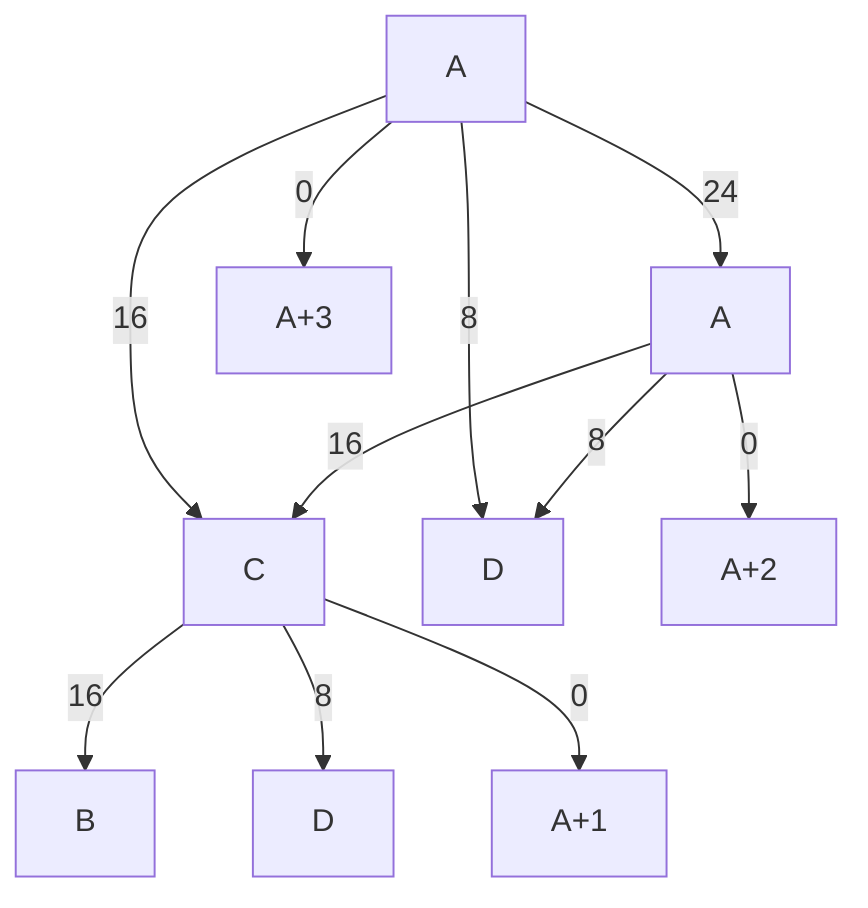
```mermaid
graph TD
    A["A"] -->|24| B["A"]
    A -->|16| C["C"]
    A -->|8| D["D"]
    A -->|0| A3["A+3"]
    B -->|16| C
    B -->|8| D
    B -->|0| A2["A+2"]
    C -->|16| B2["B"]
    C -->|8| D2["D"]
    C -->|0| A1["A+1"]
```
</details>

LDR from address offset by 2   
Figure 4-15: Little endian offset addressing

A word store (STR) should generate a word aligned address. The word presented to the data bus is not affected if the address is not word aligned. That is, bit 31 of the register being stored always appears on data bus output 31.

# Big endian configuration

A byte load (LDRB) expects the data on data bus inputs 31 through 24 if the supplied address is on a word boundary, on data bus inputs 23 through 16 if it is a word address plus one byte, and so on. The selected byte is placed in the bottom 8 bits of the destination register and the remaining bits of the register are filled with zeros. Please see Figure 3-1: Big-endian addresses of bytes within words on page 3-4.

A byte store (STRB) repeats the bottom 8 bits of the source register four times across data bus outputs 31 through 0. The external memory system should activate the appropriate byte subsystem to store the data.

A word load (LDR) should generate a word aligned address. An address offset of 0 or 2 from a word boundary will cause the data to be rotated into the register so that the addressed byte occupies bits 31 through 24. This means that half-words accessed at these offsets will be correctly loaded into bits 16 through 31 of the register. A shift operation is then required to move (and optionally sign extend) the data into the bottom 16 bits. An address offset of 1 or 3 from a word boundary will cause the data to be rotated into the register so that the addressed byte occupies bits 15 through 8.

A word store (STR) should generate a word aligned address. The word presented to the data bus is not affected if the address is not word aligned. That is, bit 31 of the register being stored always appears on data bus output 31.

# 4.9.4 Use of R15

Write-back must not be specified if R15 is specified as the base register (Rn). When using R15 as the base register you must remember it contains an address 8 bytes on from the address of the current instruction.

R15 must not be specified as the register offset (Rm).

When R15 is the source register (Rd) of a register store (STR) instruction, the stored value will be address of the instruction plus 12.

# 4.9.5 Restriction on the use of base register

When configured for late aborts, the following example code is difficult to unwind as the base register, Rn, gets updated before the abort handler starts. Sometimes it may be impossible to calculate the initial value.

After an abort, the following example code is difficult to unwind as the base register, Rn, gets updated before the abort handler starts. Sometimes it may be impossible to calculate the initial value.

# Example:

LDR R0,[R1],R1

Therefore a post-indexed LDR or STR where Rm is the same register as Rn should not be used.

# 4.9.6 Data aborts

A transfer to or from a legal address may cause problems for a memory management system. For instance, in a system which uses virtual memory the required data may be absent from main memory. The memory manager can signal a problem by taking the processor ABORT input HIGH whereupon the Data Abort trap will be taken. It is up to the system software to resolve the cause of the problem, then the instruction can be restarted and the original program continued.

# 4.9.7 Instruction cycle times

Normal LDR instructions take 1S + 1N + 1I and LDR PC take 2S + 2N +1I incremental cycles, where S,N and I are as defined in 6.2 Cycle Types on page 6-3.

STR instructions take 2N incremental cycles to execute.

4.9.8 Assembler syntax   
<LDR|STR>{cond}{B}{T} Rd,<Address>
where:
LDR load from memory into a register
STR store from a register into memory
{cond} two-character condition mnemonic. See Table 4-2: Condition code summary on page 4-5.
{B} if B is present then byte transfer, otherwise word transfer
{T} if T is present the W bit will be set in a post-indexed instruction, forcing non-privileged mode for the transfer cycle. T is not allowed when a pre-indexed addressing mode is specified or implied.
Rd is an expression evaluating to a valid register number.
Rn and Rm are expressions evaluating to a register number. If Rn is R15 then the assembler will subtract 8 from the offset value to allow for pipelining. In this case base write-back should not be specified.
<Address> can be:
1 An expression which generates an address:
<expression>
The assembler will attempt to generate an instruction using the PC as a base and a corrected immediate offset to address the location given by evaluating the expression. This will be a PC relative, pre-indexed address. If the address is out of range, an error will be generated.
2 A pre-indexed addressing specification:
[Rn] offset of zero
[Rn,<#expression>]{!} offset of <expression> bytes
[Rn, {+/-}Rm{,<shift>}]{!} offset of +/- contents of index register, shifted by <shift>
3 A post-indexed addressing specification:
[Rn],<#expression> offset of <expression> bytes
[Rn], {+/-}Rm{,<shift>} offset of +/- contents of index register, shifted as by <shift>.
<shift> general shift operation (see data processing instructions) but you cannot specify the shift amount by a register.
{!} writes back the base register (set the W bit) if! is present.   
4.9.9 Examples

STR R1, [R2, R4]! ; Store R1 at R2+R4 (both of which are registers) and write back address to R2.
STR R1, [R2], R4 ; Store R1 at R2 and write back R2+R4 to R2.

```txt
LDR R1, [R2, #16] ; Load R1 from contents of R2+16, but
; don't write back.
LDR R1, [R2, R3, LSL#2] ; Load R1 from contents of R2+R3*4.
LDREQBR1, [R6, #5] ; Conditionally load byte at R6+5 into
; R1 bits 0 to 7, filling bits 8 to 31
; with zeros.
STR R1, PLACE ; Generate PC relative offset to
; address PLACE. 
```

```txt
•
PLACE 
```

# 4.10 Halfword and Signed Data Transfer (LDRH/STRH/LDRSB/LDRSH)

The instruction is only executed if the condition is true. The various conditions are defined in Table 4-2: Condition code summary on page 4-5. The instruction encoding is shown in Figure 4-16: Halfword and signed data transfer with register offset, below, and Figure 4-17: Halfword and signed data transfer with immediate offset on page 4-33.

These instructions are used to load or store half-words of data and also load sign-extended bytes or half-words of data. The memory address used in the transfer is calculated by adding an offset to or subtracting an offset from a base register. The result of this calculation may be written back into the base register if auto-indexing is required.

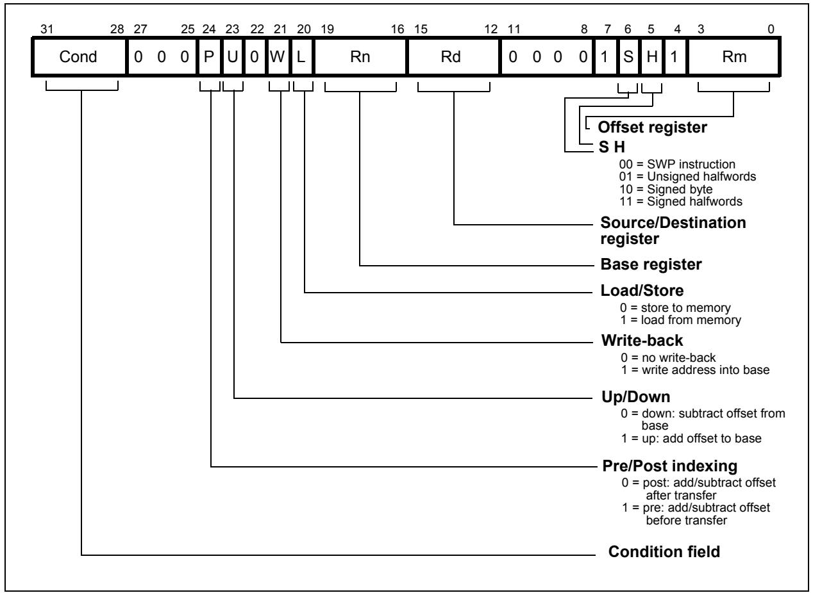

<details>
<summary>flowchart</summary>

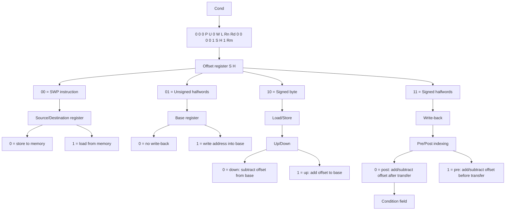
```mermaid
graph TD
    A["Cond"] --> B["0 0 0 P U 0 W L Rn Rd 0 0 0 0 1 S H 1 Rm"]
    B --> C["Offset register S H"]
    C --> D["00 = SWP instruction"]
    C --> E["01 = Unsigned halfwords"]
    C --> F["10 = Signed byte"]
    C --> G["11 = Signed halfwords"]
    D --> H["Source/Destination register"]
    E --> I["Base register"]
    F --> J["Load/Store"]
    G --> K["Write-back"]
    H --> L["0 = store to memory"]
    H --> M["1 = load from memory"]
    I --> N["0 = no write-back"]
    I --> O["1 = write address into base"]
    J --> P["Up/Down"]
    P --> Q["0 = down: subtract offset from base"]
    P --> R["1 = up: add offset to base"]
    K --> S["Pre/Post indexing"]
    S --> T["0 = post: add/subtract offset after transfer"]
    S --> U["1 = pre: add/subtract offset before transfer"]
    T --> V["Condition field"]
```
</details>

Figure 4-16: Halfword and signed data transfer with register offset

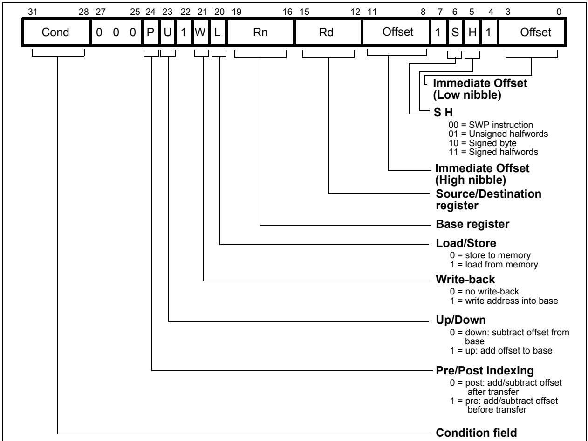

<details>
<summary>flowchart</summary>

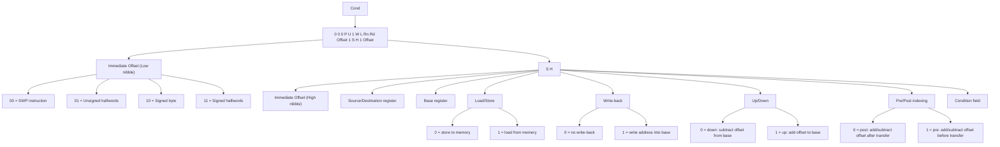
```mermaid
graph TD
    A["Cond"] --> B["0 0 0 P U 1 W L Rn Rd Offset 1 S H 1 Offset"]
    B --> C["Immediate Offset (Low nibble)"]
    B --> D["S H"]
    C --> E["00 = SWP instruction"]
    C --> F["01 = Unsigned halfwords"]
    C --> G["10 = Signed byte"]
    C --> H["11 = Signed halfwords"]
    D --> I["Immediate Offset (High nibble)"]
    D --> J["Source/Destination register"]
    D --> K["Base register"]
    D --> L["Load/Store"]
    L --> M["0 = store to memory"]
    L --> N["1 = load from memory"]
    D --> O["Write-back"]
    O --> P["0 = no write-back"]
    O --> Q["1 = write address into base"]
    D --> R["Up/Down"]
    R --> S["0 = down: subtract offset from base"]
    R --> T["1 = up: add offset to base"]
    D --> U["Pre/Post indexing"]
    U --> V["0 = post: add/subtract offset after transfer"]
    U --> W["1 = pre: add/subtract offset before transfer"]
    D --> X["Condition field"]
```
</details>

Figure 4-17: Halfword and signed data transfer with immediate offset

# 4.10.1 Offsets and auto-indexing

The offset from the base may be either a 8-bit unsigned binary immediate value in the instruction, or a second register. The 8-bit offset is formed by concatenating bits 11 to 8 and bits 3 to 0 of the instruction word, such that bit 11 becomes the MSB and bit 0 becomes the LSB. The offset may be added to (U=1) or subtracted from (U=0) the base register Rn. The offset modification may be performed either before (pre-indexed, P=1) or after (post-indexed, P=0) the base register is used as the transfer address.

The W bit gives optional auto-increment and decrement addressing modes. The modified base value may be written back into the base (W=1), or the old base may be kept (W=0). In the case of post-indexed addressing, the write back bit is redundant and is always set to zero, since the old base value can be retained if necessary by setting the offset to zero. Therefore post-indexed data transfers always write back the modified base.

The Write-back bit should not be set high (W=1) when post-indexed addressing is selected.

# 4.10.2 Halfword load and stores

Setting S=0 and H=1 may be used to transfer unsigned Half-words between an ARM7TDMI-S register and memory.

The action of LDRH and STRH instructions is influenced by the BIGEND control signal. The two possible configurations are described in the section below.

# 4.10.3 Signed byte and halfword loads

The S bit controls the loading of sign-extended data. When S=1 the H bit selects between Bytes (H=0) and Half-words (H=1). The L bit should not be set low (Store) when Signed (S=1) operations have been selected.

The LDRSB instruction loads the selected Byte into bits 7 to 0 of the destination register and bits 31 to 8 of the destination register are set to the value of bit 7, the sign bit.

The LDRSH instruction loads the selected Half-word into bits 15 to 0 of the destination register and bits 31 to 16 of the destination register are set to the value of bit 15, the sign bit.

The action of the LDRSB and LDRSH instructions is influenced by the BIGEND control signal. The two possible configurations are described in the following section.

# 4.10.4 Endianness and byte/halfword selection

# Little endian configuration

A signed byte load (LDRSB) expects data on data bus inputs 7 through to 0 if the supplied address is on a word boundary, on data bus inputs 15 through to 8 if it is a word address plus one byte, and so on. The selected byte is placed in the bottom 8 bit of the destination register, and the remaining bits of the register are filled with the sign bit, bit 7 of the byte. Please see Figure 3-2: Little-endian addresses of bytes within words on page 3-4.

A halfword load (LDRSH or LDRH) expects data on data bus inputs 15 through to 0 if the supplied address is on a word boundary and on data bus inputs 31 through to 16 if it is a halfword boundary, (A[1]=1).The supplied address should always be on a halfword boundary. If bit 0 of the supplied address is HIGH, the ARM7TDMI-S will load an unpredictable value. The selected halfword is placed in the bottom 16 bits of the destination register. For unsigned half-words (LDRH), the top 16 bits of the register are filled with zeros and for signed half-words (LDRSH) the top 16 bits are filled with the sign bit, bit 15 of the halfword.

A halfword store (STRH) repeats the bottom 16 bits of the source register twice across the data bus outputs 31 through to 0. The external memory system should activate the appropriate halfword subsystem to store the data. Note that the address must be halfword aligned, if bit 0 of the address is HIGH this will cause unpredictable behaviour.

# Big endian configuration

A signed byte load (LDRSB) expects data on data bus inputs 31 through to 24 if the supplied address is on a word boundary, on data bus inputs 23 through to 16 if it is a word address plus one byte, and so on. The selected byte is placed in the bottom 8 bit of the destination register, and the remaining bits of the register are filled with the sign bit, bit 7 of the byte. Please see Figure 3-1: Big-endian addresses of bytes within words on page 3-4.

A halfword load (LDRSH or LDRH) expects data on data bus inputs 31 through to 16 if the supplied address is on a word boundary and on data bus inputs 15 through to 0 if it is a halfword boundary, (A[1]=1). The supplied address should always be on a halfword boundary. If bit 0 of the supplied address is HIGH, the ARM7TDMI-S will load an unpredictable value. The selected halfword is placed in the bottom 16 bits of the destination register. For unsigned half-words (LDRH), the top 16 bits of the register are filled with zeros and for signed half-words (LDRSH) the top 16 bits are filled with the sign bit, bit 15 of the halfword.

A halfword store (STRH) repeats the bottom 16 bits of the source register twice across the data bus outputs 31 through to 0. The external memory system should activate the appropriate halfword subsystem to store the data. Note that the address must be halfword aligned, if bit 0 of the address is HIGH this will cause unpredictable behaviour.

# 4.10.5 Use of R15

Write-back should not be specified if R15 is specified as the base register (Rn). When using R15 as the base register you must remember it contains an address 8 bytes on from the address of the current instruction.

R15 should not be specified as the register offset (Rm).

When R15 is the source register (Rd) of a Half-word store (STRH) instruction, the stored address will be address of the instruction plus 12.

# 4.10.6 Data aborts

A transfer to or from a legal address may cause problems for a memory management system. For instance, in a system which uses virtual memory the required data may be absent from the main memory. The memory manager can signal a problem by taking the processor ABORT input HIGH whereupon the Data Abort trap will be taken. It is up to the system software to resolve the cause of the problem, then the instruction can be restarted and the original program continued.

# 4.10.7 Instruction cycle times

Normal LDR(H,SH,SB) instructions take 1S + 1N + 1I

LDR(H,SH,SB) PC take 2S + 2N + 1I incremental cycles.

S,N and I are defined in 6.2 Cycle Types on page 6-3.

STRH instructions take 2N incremental cycles to execute.

# 4.10.8 Assembler syntax

```txt
<LDR|STR>{cond}<H|SH|SB> Rd,<address>
LDR load from memory into a register
STR Store from a register into memory
{cond} two-character condition mnemonic. See Table 4-2: Condition code summary on page 4-5.
H Transfer halfword quantity
SB Load sign extended byte (Only valid for LDR)
SH Load sign extended halfword (Only valid for LDR)
Rd is an expression evaluating to a valid register number.
<address> can be: 
```

1 An expression which generates an address:

<expression>

The assembler will attempt to generate an instruction using the PC as a base and a corrected immediate offset to address the location given by evaluating the expression. This will be a PC relative, pre-indexed address. If the address is out of range, an error will be generated.

2 A pre-indexed addressing specification:

[Rn] offset of zero

```txt
[Rn,<#expression>]{!} offset of <expression> bytes
[Rn,{+/−}Rm]{!} offset of +/- contents of index register 
```

3 A post-indexed addressing specification:

```txt
[Rn],<#expression> offset of <expression> bytes
[Rn],{+/-}Rm offset of +/- contents of index register. 
```

Rn and Rm are expressions evaluating to a register number. If Rn is R15 then the assembler will subtract 8 from the offset value to allow for pipelining. In this case base write-back should not be specified.

{!} writes back the base register (set the W bit) if ! is present.

# 4.10.9 Examples

```asm
LDRHR1, [R2,-R3]!; Load R1 from the contents of the
; halfword address contained in
; R2-R3 (both of which are registers)
; and write back address to R2
STRHR3, [R4,#14]; Store the halfword in R3 at R14+14
; but don't write back.
LDRSBR8, [R2], #-223; Load R8 with the sign extended
; contents of the byte address
; contained in R2 and write back
; R2-223 to R2.
LDRNESHR11, [R0]; conditionally load R11 with the sign
; extended contents of the halfword
; address contained in R0.
HERE ; Generate PC relative offset to
; address FRED.
; Store the halfword in R5 at address
; FRED.
STRHR5, [PC, #(FRED-HERE-8)]
.
FRED 
```

# 4.11 Block Data Transfer (LDM, STM)

The instruction is only executed if the condition is true. The various conditions are defined in Table 4-2: Condition code summary on page 4-5. The instruction encoding is shown in Figure 4-18: Block data transfer instructions.

Block data transfer instructions are used to load (LDM) or store (STM) any subset of the currently visible registers. They support all possible stacking modes, maintaining full or empty stacks which can grow up or down memory, and are very efficient instructions for saving or restoring context, or for moving large blocks of data around main memory.

# 4.11.1 The register list

The instruction can cause the transfer of any registers in the current bank (and non-user mode programs can also transfer to and from the user bank, see below). The register list is a 16 bit field in the instruction, with each bit corresponding to a register. A 1 in bit 0 of the register field will cause R0 to be transferred, a 0 will cause it not to be transferred; similarly bit 1 controls the transfer of R1, and so on.

Any subset of the registers, or all the registers, may be specified. The only restriction is that the register list should not be empty.

Whenever R15 is stored to memory the stored value is the address of the STM instruction plus 12.

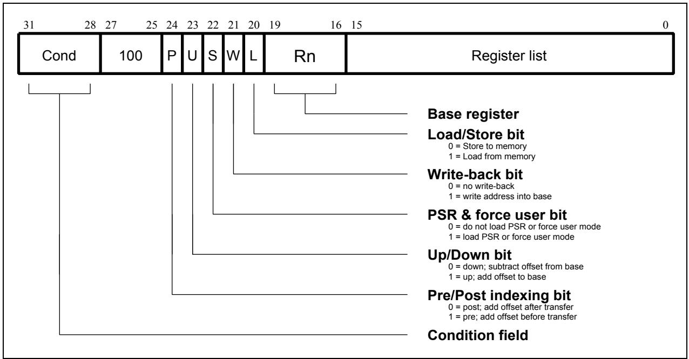

<details>
<summary>other</summary>

| Bit Type              | Bit Position | Bit Type              | Bit Position | Bit Type              |
|-----------------------|--------------|-----------------------|--------------|-----------------------|
| Base register         | 100          | P                     | U            | S                     |
| Load/Store bit        | 0            | 0                     | 0            | Store to memory       |
| Write-back bit        | 0            | 0                     | 0            | no write-back         |
| PSR & force user bit  | 0            | 0                     | 0            | do not load PSR or force user mode |
| Up/Down bit           | 0            | 0                     | 0            | down; subtract offset from base |
| Pre/Post indexing bit | 0            | 0                     | 0            | post; add offset after transfer |
| Condition field       | 0            | 0                     | 0            | pre; add offset before transfer |
</details>

Figure 4-18: Block data transfer instructions

# 4.11.2 Addressing modes

The transfer addresses are determined by the contents of the base register (Rn), the pre/post bit (P) and the up/down bit (U). The registers are transferred in the order lowest to highest, so R15 (if in the list) will always be transferred last. The lowest register also gets transferred to/from the lowest memory address. By way of illustration, consider the transfer of R1, R5 and R7 in the case where Rn=0x1000 and write back of the modified base is required (W=1). Figure 4-19: Post-increment addressing on page 4-38,

Figure 4-20: Pre-increment addressing on page 4-39, Figure 4-21: Post-decrement addressing on page 4-39 and Figure 4-22: Pre-decrement addressing on page 4-40 show the sequence of register transfers, the addresses used, and the value of Rn after the instruction has completed.

In all cases, had write back of the modified base not been required (W=0), Rn would have retained its initial value of 0x1000 unless it was also in the transfer list of a load multiple register instruction, when it would have been overwritten with the loaded value.

# 4.11.3 Address alignment

The address should normally be a word aligned quantity and non-word aligned addresses do not affect the instruction. However, the bottom 2 bits of the address will appear on A[1:0] and might be interpreted by the memory system.

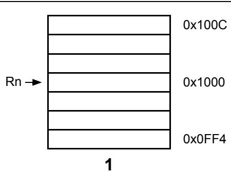

<details>
<summary>text_image</summary>

0x100C
0x1000
0x0FF4
1
</details>

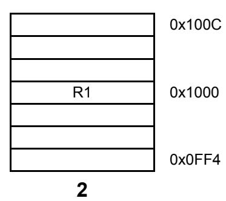

<details>
<summary>text_image</summary>

0x100C
R1
0x1000
0x0FF4
2
</details>

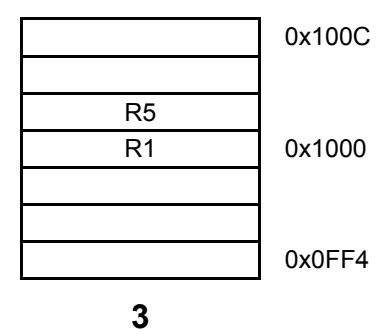

<details>
<summary>text_image</summary>

0x100C
R5
R1
0x1000
0x0FF4
3
</details>

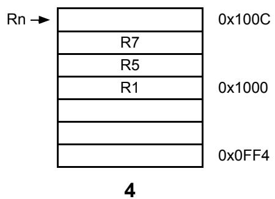

<details>
<summary>text_image</summary>

Rn →
R7
R5
R1
0x100C
0x1000
0x0FF4
4
</details>

Figure 4-19: Post-increment addressing

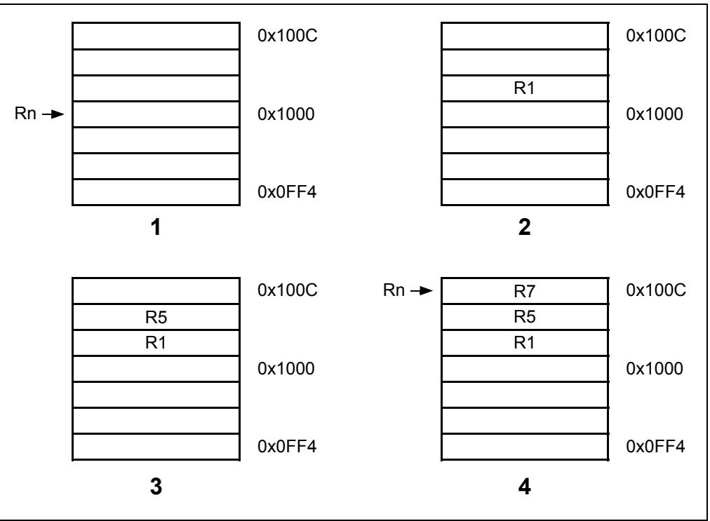  
Figure 4-20: Pre-increment addressing

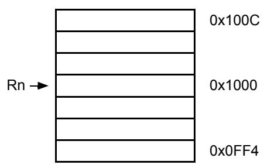

<details>
<summary>text_image</summary>

0x100C
0x1000
0x0FF4
Rn →
</details>

1

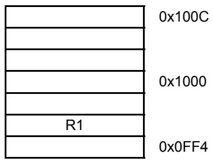

<details>
<summary>text_image</summary>

0x100C
0x1000
R1
0x0FF4
</details>

2

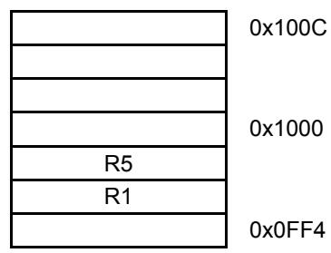

<details>
<summary>text_image</summary>

0x100C
0x1000
R5
R1
0x0FF4
</details>

3

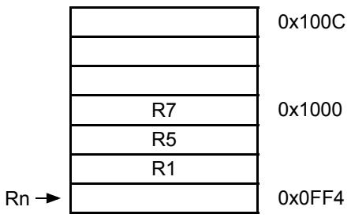

<details>
<summary>text_image</summary>

0x100C
R7
0x1000
R5
R1
0x0FF4
Rn →
</details>

4   
Figure 4-21: Post-decrement addressing

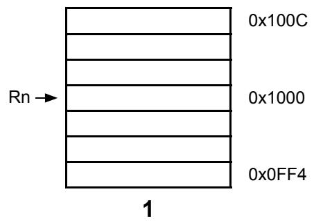

<details>
<summary>text_image</summary>

0x100C
0x1000
0x0FF4
1
</details>

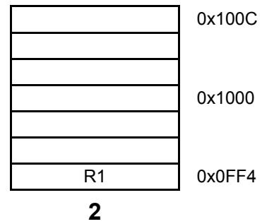

<details>
<summary>text_image</summary>

0x100C
0x1000
R1
0x0FF4
2
</details>

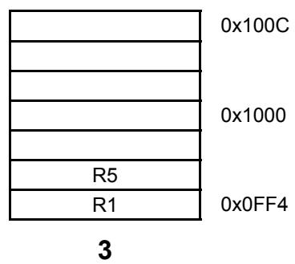

<details>
<summary>text_image</summary>

0x100C
0x1000
R5
R1
0x0FF4
3
</details>

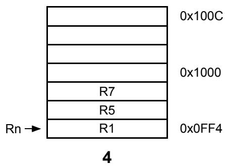

<details>
<summary>text_image</summary>

0x100C
0x1000
R7
R5
R1
0x0FF4
Rn →
4
</details>

Figure 4-22: Pre-decrement addressing

# 4.11.4 Use of the S bit

When the S bit is set in a LDM/STM instruction its meaning depends on whether or not R15 is in the transfer list and on the type of instruction. The S bit should only be set if the instruction is to execute in a privileged mode.

# LDM with R15 in transfer list and S bit set (Mode changes)

If the instruction is a LDM then SPSR\_<mode> is transferred to CPSR at the same time as R15 is loaded.

# STM with R15 in transfer list and S bit set (User bank transfer)

The registers transferred are taken from the User bank rather than the bank corresponding to the current mode. This is useful for saving the user state on process switches. Base write-back should not be used when this mechanism is employed.

# R15 not in list and S bit set (User bank transfer)

For both LDM and STM instructions, the User bank registers are transferred rather than the register bank corresponding to the current mode. This is useful for saving the user state on process switches. Base write-back should not be used when this mechanism is employed.

When the instruction is LDM, care must be taken not to read from a banked register during the following cycle (inserting a dummy instruction such as MOV R0, R0 after the LDM will ensure safety).

# 4.11.5 Use of R15 as the base

R15 should not be used as the base register in any LDM or STM instruction.

# 4.11.6 Inclusion of the base in the register list

When write-back is specified, the base is written back at the end of the second cycle of the instruction. During a STM, the first register is written out at the start of the second cycle. A STM which includes storing the base, with the base as the first register to be stored, will therefore store the unchanged value, whereas with the base second or later in the transfer order, will store the modified value. A LDM will always overwrite the updated base if the base is in the list.

# 4.11.7 Data aborts

Some legal addresses may be unacceptable to a memory management system, and the memory manager can indicate a problem with an address by taking the ABORT signal HIGH. This can happen on any transfer during a multiple register load or store, and must be recoverable if ARM7TDMI-S is to be used in a virtual memory system.

# Aborts during STM instructions

If the abort occurs during a store multiple instruction, ARM7TDMI-S takes little action until the instruction completes, whereupon it enters the data abort trap. The memory manager is responsible for preventing erroneous writes to the memory. The only change to the internal state of the processor will be the modification of the base register if write-back was specified, and this must be reversed by software (and the cause of the abort resolved) before the instruction may be retried.

# Aborts during LDM instructions

When ARM7TDMI-S detects a data abort during a load multiple instruction, it modifies the operation of the instruction to ensure that recovery is possible.

Overwriting of registers stops when the abort happens. The aborting load will not take place but earlier ones may have overwritten registers. The PC is always the last register to be written and so will always be preserved.   
2 The base register is restored, to its modified value if write-back was requested. This ensures recoverability in the case where the base register is also in the transfer list, and may have been overwritten before the abort occurred.

The data abort trap is taken when the load multiple has completed, and the system software must undo any base modification (and resolve the cause of the abort) before restarting the instruction.

# 4.11.8 Instruction cycle times

Normal LDM instructions take nS + 1N + 1I and LDM PC takes (n+1)S + 2N + 1I incremental cycles, where S,N and I are as defined in 6.2 Cycle Types on page 6-3. STM instructions take (n-1)S + 2N incremental cycles to execute, where n is the number of words transferred.

# 4.11.9 Assembler syntax

<LDM|STM>{cond}<FD|ED|FA|EA|IA|IB|DA|DB> Rn{!},<Rlist>{^} where:

{cond} two-character condition mnemonic. See Table 4-2: Condition code summary on page 4-5.

Rn is an expression evaluating to a valid register number

<Rlist> is a list of registers and register ranges enclosed in {} (For example, {R0,R2-R7,R10}).

{!} if present requests write-back (W=1), otherwise W=0

{^} if present set S bit to load the CPSR along with the PC, or force transfer of user bank when in privileged mode

# Addressing mode names

There are different assembler mnemonics for each of the addressing modes, depending on whether the instruction is being used to support stacks or for other purposes. The equivalence between the names and the values of the bits in the instruction are shown in Table 4-6: Addressing mode names:

<table><tr><td>Name</td><td>Stack</td><td>Other</td><td>L bit</td><td>P bit</td><td>U bit</td></tr><tr><td>pre-increment load</td><td>LDMED</td><td>LDMIB</td><td>1</td><td>1</td><td>1</td></tr><tr><td>post-increment load</td><td>LDMFD</td><td>LDMIA</td><td>1</td><td>0</td><td>1</td></tr><tr><td>pre-decrement load</td><td>LDMEA</td><td>LDMDB</td><td>1</td><td>1</td><td>0</td></tr><tr><td>post-decrement load</td><td>LDMFA</td><td>LDMDA</td><td>1</td><td>0</td><td>0</td></tr><tr><td>pre-increment store</td><td>STMFA</td><td>STMIB</td><td>0</td><td>1</td><td>1</td></tr><tr><td>post-increment store</td><td>STMEA</td><td>STMIA</td><td>0</td><td>0</td><td>1</td></tr><tr><td>pre-decrement store</td><td>STMFD</td><td>STMDB</td><td>0</td><td>1</td><td>0</td></tr><tr><td>post-decrement store</td><td>STMED</td><td>STMDA</td><td>0</td><td>0</td><td>0</td></tr></table>

Table 4-6: Addressing mode names

FD, ED, FA, EA define pre- or post-indexing and the up/down bit by reference to the form of stack required. The F and E refer to a “full” or “empty” stack, ie. whether a preindex has to be done (full) before storing to the stack. The A and D refer to whether the stack is ascending or descending. If ascending, a STM will go up and LDM down; if descending, vice-versa.

IA, IB, DA, DB allow control when LDM/STM are not being used for stacks and simply mean Increment After, Increment Before, Decrement After, Decrement Before.

# 4.11.10Examples

```prolog
LDMFD SP!, {R0, R1, R2} ; Unstack 3 registers.
STMIA R0, {R0-R15} ; Save all registers.
LDMFD SP!, {R15} ; R15 <- (SP), CPSR unchanged.
LDMFD SP!, {R15}^ ; R15 <- (SP), CPSR <- SPSR_mode
; (allowed only in privileged modes).
STMFD R13, {R0-R14}^ ; Save user mode regs on stack
; (allowed only in privileged modes). 
```

These instructions may be used to save state on subroutine entry, and restore it efficiently on return to the calling routine:

```txt
STMED SP!, {R0-R3, R14} ; Save R0 to R3 to use as workspace ; and R14 for returning.
BL somewhere ; This nested call will overwrite R14
LDMED SP!, {R0-R3, R15} ; restore workspace and return. 
```

# 4.12 Single Data Swap (SWP)

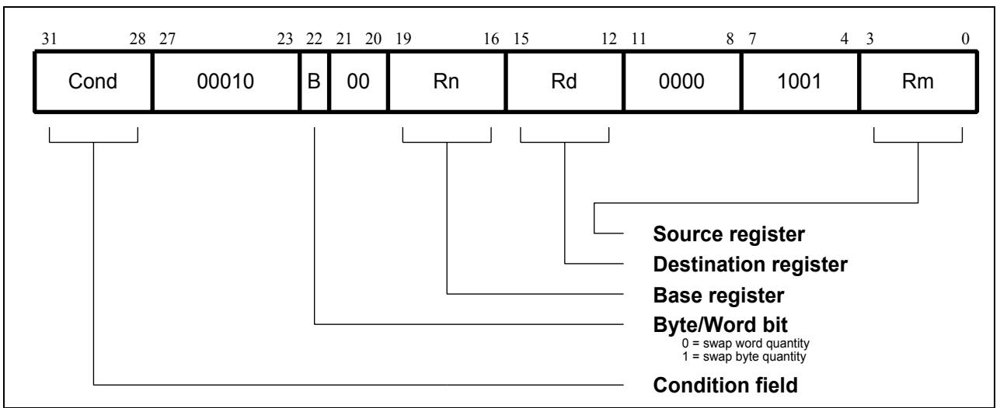

<details>
<summary>text_image</summary>

31 28 27 23 22 21 20 19 16 15 12 11 8 7 4 3 0
Cond 00010 B 00 Rn Rd 0000 1001 Rm
Source register
Destination register
Base register
Byte/Word bit
0 = swap word quantity
1 = swap byte quantity
Condition field
</details>

Figure 4-23: Swap instruction

The instruction is only executed if the condition is true. The various conditions are defined in Table 4-2: Condition code summary on page 4-5. The instruction encoding is shown in Figure 4-23: Swap instruction.

The data swap instruction is used to swap a byte or word quantity between a register and external memory. This instruction is implemented as a memory read followed by a memory write which are “locked” together (the processor cannot be interrupted until both operations have completed, and the memory manager is warned to treat them as inseparable). This class of instruction is particularly useful for implementing software semaphores.

The swap address is determined by the contents of the base register (Rn). The processor first reads the contents of the swap address. Then it writes the contents of the source register (Rm) to the swap address, and stores the old memory contents in the destination register (Rd). The same register may be specified as both the source and destination.

The LOCK output goes HIGH for the duration of the read and write operations to signal to the external memory manager that they are locked together, and should be allowed to complete without interruption. This is important in multi-processor systems where the swap instruction is the only indivisible instruction which may be used to implement semaphores; control of the memory must not be removed from a processor while it is performing a locked operation.

# 4.12.1 Bytes and words

This instruction class may be used to swap a byte (B=1) or a word (B=0) between an ARM7TDMI-S register and memory. The SWP instruction is implemented as a LDR followed by a STR and the action of these is as described in the section on single data transfers. In particular, the description of Big and Little Endian configuration applies to the SWP instruction.

# 4.12.2 Use of R15

Do not use R15 as an operand (Rd, Rn or Rs) in a SWP instruction.

# 4.12.3 Data aborts

If the address used for the swap is unacceptable to a memory management system, the memory manager can flag the problem by driving ABORT HIGH. This can happen on either the read or the write cycle (or both), and in either case, the Data Abort trap will be taken. It is up to the system software to resolve the cause of the problem, then the instruction can be restarted and the original program continued.

# 4.12.4 Instruction cycle times

Swap instructions take 1S + 2N +1I incremental cycles to execute, where S,N and I are as defined in 6.2 Cycle Types on page 6-3.

# 4.12.5 Assembler syntax

```txt
<SWP>{cond}{B} Rd, Rm, [Rn]
{cond} two-character condition mnemonic. See Table 4-2: Condition code summary on page 4-5.
{B} if B is present then byte transfer, otherwise word transfer
Rd, Rm, Rn are expressions evaluating to valid register numbers 
```

# 4.12.6 Examples

```asm
SWP R0,R1,[R2] ; Load R0 with the word addressed by R2, and
; store R1 at R2.
SWPB R2,R3,[R4] ; Load R2 with the byte addressed by R4, and
; store bits 0 to 7 of R3 at R4.
SWPEQ R0,R0,[R1] ; Conditionally swap the contents of the
; word addressed by R1 with R0. 
```

# 4.13 Software Interrupt (SWI)

The instruction is only executed if the condition is true. The various conditions are defined in Table 4-2: Condition code summary on page 4-5. The instruction encoding is shown in Figure 4-24: Software interrupt instruction, below.

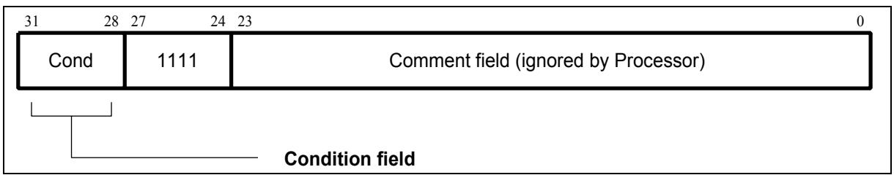

<details>
<summary>text_image</summary>

31 28 27 24 23 0
Cond 1111 Comment field (ignored by Processor)
Condition field
</details>

Figure 4-24: Software interrupt instruction

The software interrupt instruction is used to enter Supervisor mode in a controlled manner. The instruction causes the software interrupt trap to be taken, which effects the mode change. The PC is then forced to a fixed value (0x08) and the CPSR is saved in SPSR\_svc. If the SWI vector address is suitably protected (by external memory management hardware) from modification by the user, a fully protected operating system may be constructed.

# 4.13.1 Return from the supervisor

The PC is saved in R14\_svc upon entering the software interrupt trap, with the PC adjusted to point to the word after the SWI instruction. MOVS PC,R14\_svc will return to the calling program and restore the CPSR.

Note that the link mechanism is not re-entrant, so if the supervisor code wishes to use software interrupts within itself it must first save a copy of the return address and SPSR.

# 4.13.2 Comment field

The bottom 24 bits of the instruction are ignored by the processor, and may be used to communicate information to the supervisor code. For instance, the supervisor may look at this field and use it to index into an array of entry points for routines which perform the various supervisor functions.

# 4.13.3 Instruction cycle times

Software interrupt instructions take 2S + 1N incremental cycles to execute, where S and N are as defined in 6.2 Cycle Types on page 6-3.

# 4.13.4 Assembler syntax

```txt
SWI{cond} <expression>
{cond} two character condition mnemonic, Table 4-2: Condition code summary on page 4-5.
<expression> is evaluated and placed in the comment field (which is ignored by ARM7TDMI-S). 
```

# 4.13.5 Examples

```txt
SWI ReadC ; Get next character from read stream.
SWI WriteI+"k" ; Output a "k" to the write stream.
SWINE 0 ; Conditionally call supervisor
; with 0 in comment field. 
```

# Supervisor code

The previous examples assume that suitable supervisor code exists, for instance:

```txt
0x08 B Supervisor ; SWI entry point
EntryTable ; addresses of supervisor routines
    DCD ZeroRtn
    DCD ReadCRtn
    DCD WriteIRtn
    . . .
Zero EQU 0
ReadC EQU 256
WriteI EQU 512 
```

Supervisor

```txt
; SWI has routine required in bits 8-23 and data (if any) in
; bits 0-7.
; Assumes R13_svc points to a suitable stack 
```

```prolog
STMFD R13, {R0-R2, R14} ; Save work registers and return
; address.
LDR R0, [R14, #-4] ; Get SWI instruction.
BIC R0, R0, #0xFF000000 ; Clear top 8 bits.
MOV R1, R0, LSR#8 ; Get routine offset.
ADR R2,EntryTable ; Get start address of entry table.
LDR R15, [R2, R1, LSL#2] ; Branch to appropriate routine. 
```

```txt
WriteIRtn ; Enter with character in R0 bits 0-7.
LDMFD R13, {R0-R2,R15}^ ; Restore workspace and return,
; restoring processor mode and flags. 
```

# 4.14 Coprocessor Data Operations (CDP)

The instruction is only executed if the condition is true. The various conditions are defined in Table 4-2: Condition code summary on page 4-5. The instruction encoding is shown in Figure 4-25: Coprocessor data operation instruction.

This class of instruction is used to tell a coprocessor to perform some internal operation. No result is communicated back to ARM7TDMI-S, and it will not wait for the operation to complete. The coprocessor could contain a queue of such instructions awaiting execution, and their execution can overlap other activity, allowing the coprocessor and ARM7TDMI-S to perform independent tasks in parallel.

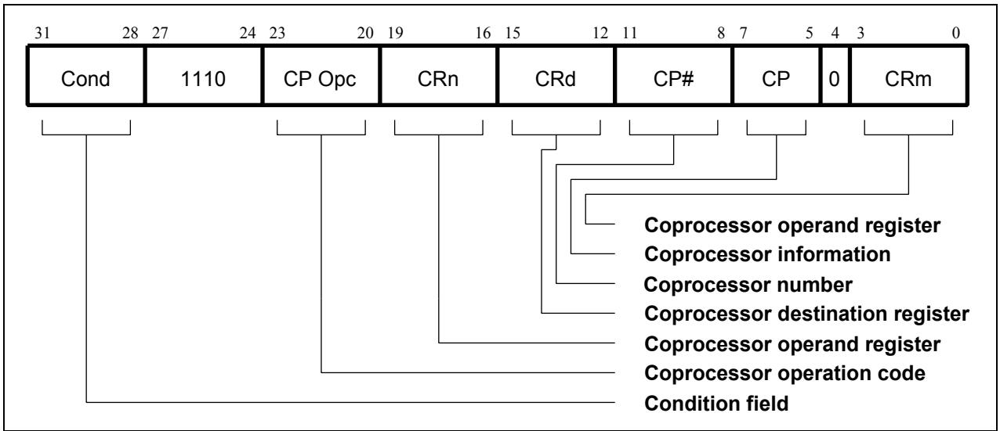

<details>
<summary>text_image</summary>

31 28 27 24 23 20 19 16 15 12 11 8 7 5 4 3 0
Cond 1110 CP Opc CRn CRd CP# CP 0 CRm
Coprocessor operand register
Coprocessor information
Coprocessor number
Coprocessor destination register
Coprocessor operand register
Coprocessor operation code
Condition field
</details>

Figure 4-25: Coprocessor data operation instruction

# 4.14.1 The coprocessor fields

Only bit 4 and bits 24 to 31 are significant to ARM7TDMI-S. The remaining bits are used by coprocessors. The above field names are used by convention, and particular coprocessors may redefine the use of all fields except CP# as appropriate. The CP# field is used to contain an identifying number (in the range 0 to 15) for each coprocessor, and a coprocessor will ignore any instruction which does not contain its number in the CP# field.

The conventional interpretation of the instruction is that the coprocessor should perform an operation specified in the CP Opc field (and possibly in the CP field) on the contents of CRn and CRm, and place the result in CRd.

# 4.14.2 Instruction cycle times

Coprocessor data operations take 1S + bI incremental cycles to execute, where b is the number of cycles spent in the coprocessor busy-wait loop.

S and I are as defined in 6.2 Cycle Types on page 6-3.

4.14.3 Assembler syntax   
```txt
CDP{cond} p#,<expression1>, cd, cn, cm{,<expression2>}
{cond} two character condition mnemonic. See Table 4-2: Condition code summary on page 4-5.
p# the unique number of the required coprocessor
<expression1> evaluated to a constant and placed in the CP Opc field
cd, cn and cm evaluate to the valid coprocessor register numbers CRd, CRn and CRm respectively
<expression2> where present is evaluated to a constant and placed in the CP field 
```  
4.14.4 Examples

```csv
CDP p1,10,c1,c2,c3 ; Request coproc 1 to do operation 10
; on CR2 and CR3, and put the result
; in CR1.
CDPEQ p2,5,c1,c2,c3,2 ; If Z flag is set request coproc 2
; to do operation 5 (type 2) on CR2
; and CR3, and put the result in CR1. 
```

# 4.15 Coprocessor Data Transfers (LDC, STC)

The instruction is only executed if the condition is true. The various conditions are defined in Table 4-2: Condition code summary on page 4-5. The instruction encoding is shown in Figure 4-26: Coprocessor data transfer instructions.

This class of instruction is used to load (LDC) or store (STC) a subset of a coprocessors’s registers directly to memory. ARM7TDMI-S is responsible for supplying the memory address, and the coprocessor supplies or accepts the data and controls the number of words transferred.

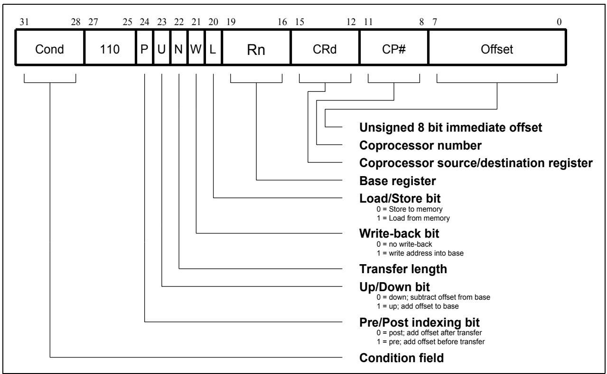  
Figure 4-26: Coprocessor data transfer instructions

# 4.15.1 The coprocessor fields

The CP# field is used to identify the coprocessor which is required to supply or accept the data, and a coprocessor will only respond if its number matches the contents of this field.

The CRd field and the N bit contain information for the coprocessor which may be interpreted in different ways by different coprocessors, but by convention CRd is the register to be transferred (or the first register where more than one is to be transferred), and the N bit is used to choose one of two transfer length options. For instance N=0 could select the transfer of a single register, and N=1 could select the transfer of all the registers for context switching.

# 4.15.2 Addressing modes

ARM7TDMI-S is responsible for providing the address used by the memory system for the transfer, and the addressing modes available are a subset of those used in single data transfer instructions. Note, however, that the immediate offsets are 8 bits wide and specify word offsets for coprocessor data transfers, whereas they are 12 bits wide and specify byte offsets for single data transfers.

The 8 bit unsigned immediate offset is shifted left 2 bits and either added to (U=1) or subtracted from (U=0) the base register (Rn); this calculation may be performed either before (P=1) or after (P=0) the base is used as the transfer address. The modified base value may be overwritten back into the base register (if W=1), or the old value of the base may be preserved (W=0). Note that post-indexed addressing modes require explicit setting of the W bit, unlike LDR and STR which always write-back when postindexed.

The value of the base register, modified by the offset in a pre-indexed instruction, is used as the address for the transfer of the first word. The second word (if more than one is transferred) will go to or come from an address one word (4 bytes) higher than the first transfer, and the address will be incremented by one word for each subsequent transfer.

# 4.15.3 Address alignment

The base address should normally be a word aligned quantity. The bottom 2 bits of the address will appear on A[1:0] and might be interpreted by the memory system.

# 4.15.4 Use of R15

If Rn is R15, the value used will be the address of the instruction plus 8 bytes. Base write-back to R15 must not be specified.

# 4.15.5 Data aborts

If the address is legal but the memory manager generates an abort, the data trap will be taken. The write-back of the modified base will take place, but all other processor state will be preserved. The coprocessor is partly responsible for ensuring that the data transfer can be restarted after the cause of the abort has been resolved, and must ensure that any subsequent actions it undertakes can be repeated when the instruction is retried.

# 4.15.6 Instruction cycle times

Coprocessor data transfer instructions take (n-1)S + 2N + bI incremental cycles to execute, where:

```txt
n is the number of words transferred.
b is the number of cycles spent in the coprocessor busy-wait loop. 
```

S, N and I are as defined in 6.2 Cycle Types on page 6-3.

# 4.15.7 Assembler syntax

```txt
<LDC|STC>{cond}{L} p#, cd, <Address>
LDC load from memory to coprocessor
STC store from coprocessor to memory
{L} when present perform long transfer (N=1), otherwise perform short transfer (N=0)
{cond} two character condition mnemonic. See Table 4-2: Condition code summary on page 4-5.
p# the unique number of the required coprocessor
cd is an expression evaluating to a valid coprocessor register number that is placed in the CRd field
 España can be:
1 An expression which generates an address: 
```

```txt
<expression> 
```

The assembler will attempt to generate an instruction using the PC as a base and a corrected immediate offset to address the location given by evaluating the expression. This will be a PC relative, pre-indexed address. If the address is out of range, an error will be generated.

2 A pre-indexed addressing specification:

```txt
[Rn] offset of zero
[Rn, <#expression>] { ! } offset of <expression> bytes 
```

3 A post-indexed addressing specification:

```txt
[Rn], <#expression> offset of <expression> bytes
{!} write back the base register (set the W bit) if! is present
Rn is an expression evaluating to a valid ARM7TDMI-S register number. 
```

Note If Rn is R15, the assembler will subtract 8 from the offset value to allow for pipelining.

# 4.15.8 Examples

```prolog
LDCp1,c2,table; Load c2 of coproc 1 from address
; table, using a PC relative address.
STCEQLp2,c3,[R5,#24]!; Conditionally store c3 of coproc 2
; into an address 24 bytes up from R5,
; write this address back to R5, and use
; long transfer option (probably to
; store multiple words). 
```

Note Although the address offset is expressed in bytes, the instruction offset field is in words. Theassembler will adjust the offset appropriately.

# 4.16 Coprocessor Register Transfers (MRC, MCR)

The instruction is only executed if the condition is true. The various conditions are defined in Table 4-2: Condition code summary on page 4-5. The instruction encoding is shown in Figure 4-27: Coprocessor register transfer instructions.

This class of instruction is used to communicate information directly between ARM7TDMI-S and a coprocessor. An example of a coprocessor to ARM7TDMI-S register transfer (MRC) instruction would be a FIX of a floating point value held in a coprocessor, where the floating point number is converted into a 32 bit integer within the coprocessor, and the result is then transferred to the ARM7TDMI-S register. A FLOAT of a 32 bit value in ARM7TDMI-S register into a floating point value within the coprocessor illustrates the use of ARM7TDMI-S register to coprocessor transfer (MCR).

An important use of this instruction is to communicate control information directly from the coprocessor into the ARM7TDMI-S CPSR flags. As an example, the result of a comparison of two floating point values within a coprocessor can be moved to the CPSR to control the subsequent flow of execution.

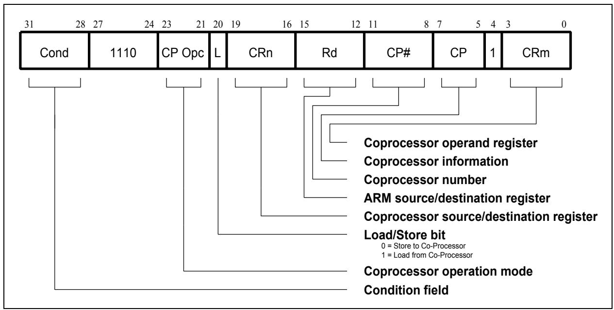

<details>
<summary>text_image</summary>

31 28 27 24 23 21 20 19 16 15 12 11 8 7 5 4 3 0
Cond 1110 CP Opc L CRn Rd CP# CP 1 CRm
Coprocessor operand register
Coprocessor information
Coprocessor number
ARM source/destination register
Coprocessor source/destination register
Load/Store bit
0 = Store to Co-Processor
1 = Load from Co-Processor
Coprocessor operation mode
Condition field
</details>

Figure 4-27: Coprocessor register transfer instructions

# 4.16.1 The coprocessor fields

The CP# field is used, as for all coprocessor instructions, to specify which coprocessor is being called upon.

The CP Opc, CRn, CP and CRm fields are used only by the coprocessor, and the interpretation presented here is derived from convention only. Other interpretations are allowed where the coprocessor functionality is incompatible with this one. The conventional interpretation is that the CP Opc and CP fields specify the operation the coprocessor is required to perform, CRn is the coprocessor register which is the source or destination of the transferred information, and CRm is a second coprocessor register which may be involved in some way which depends on the particular operation specified.

# 4.16.2 Transfers to R15

When a coprocessor register transfer to ARM7TDMI-S has R15 as the destination, bits 31, 30, 29 and 28 of the transferred word are copied into the N, Z, C and V flags respectively. The other bits of the transferred word are ignored, and the PC and other CPSR bits are unaffected by the transfer.

# 4.16.3 Transfers from R15

A coprocessor register transfer from ARM7TDMI-S with R15 as the source register will store the PC+12.

# 4.16.4 Instruction cycle times

MRC instructions take 1S + (b+1)I +1C incremental cycles to execute, where S, I and C are as defined in 6.2 Cycle Types on page 6-3.

MCR instructions take 1S + bI +1C incremental cycles to execute, where b is the number of cycles spent in the coprocessor busy-wait loop.

# 4.16.5 Assembler syntax

```txt
<MCR|MRC>{cond} p#,<expression1>,Rd,cn,cm{,<expression2>}
MRC move from coprocessor to ARM7TDMI-S register (L=1)
MCR move from ARM7TDMI-S register to coprocessor (L=0)
{cond} two character condition mnemonic. See Table 4-2: Condition code summary on page 4-5.
p# the unique number of the required coprocessor
<expression1> evaluated to a constant and placed in the CP Opc field
Rd is an expression evaluating to a valid ARM7TDMI-S register number
cn and cm are expressions evaluating to the valid coprocessor register numbers CRn and CRm respectively
<expression2> where present is evaluated to a constant and placed in the CP field 
```

# 4.16.6 Examples

```txt
MRCp2,5,R3,c5,c6 ; Request coproc 2 to perform operation 5; on c5 and c6, and transfer the (single; 32 bit word) result back to R3. 
```

```txt
MCRp6,0,R4,c5,c6 ; Request coproc 6 to perform operation 0 ; on R4 and place the result in c6. 
```

```csv
MRCEQp3,9,R3,c5,c6,2; Conditionally request coproc 3 to
; perform operation 9 (type 2) on c5 and
; c6, and transfer the result back to R3. 
```

# 4.17 Undefined Instruction

The instruction is only executed if the condition is true. The various conditions are defined in Table 4-2: Condition code summary on page 4-5. The undefined instruction trap mechanism is provided to trap usage of currently unused instruction encodings.This mechanism can be used to provide backwards compatibility by allowing emulation of instructions included in future architectures. Operating systems can also make use of this mechanism to set instruction breakpoints, which will return control to the operating system through the undefined instruction trap mechanism. There are a number of areas of undefined instruction space, the largest of which is encoded as follows: Figure 4-28: Undefined instruction

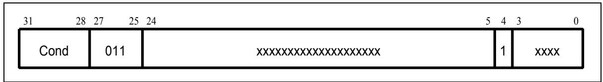

<details>
<summary>text_image</summary>

31 28 27 25 24 5 4 3 0
Cond 011 xxxxxxxxxxxxxxxxxxxxx 1 xxxx
</details>

Figure 4-28:Undefined instruction

If the condition is true, the undefined instruction trap will be taken. If an undefined instruction is required, we would recommend the use of this instruction with all the bits marked x set to 0

# 4.17.1 Instruction cycle times

This instruction takes 2S + 1I + 1N cycles, where S, N and I are as defined in 6.2 Cycle Types on page 6-3.

# 4.17.2 Assembler syntax

The assembler has no mnemonics for generating this instruction. If it is adopted in the future for some specified use, suitable mnemonics will be added to the assembler.

# 4.18 Instruction Set Examples

The following examples show ways in which the basic ARM instructions can combine to give efficient code. None of these methods saves a great deal of execution time (although they may save some), mostly they just save code.

# 4.18.1 Using the conditional instructions

Using conditionals for logical OR   
```csv
CMP Rn,#p ; If Rn=p OR Rm=q THEN GOTO Label.
BEQ Label
CMP Rm,#q
BEQ Label 
```

This can be replaced by   
```csv
CMP Rn,#p
CMPNE Rm,#q ; If condition not satisfied try
; other test.
BEQ Label 
```

Absolute value   
```txt
TEQ Rn,#0 ; Test sign
RSBMI Rn,Rn,#0 ; and 2's complement if necessary. 
```

Multiplication by 4, 5 or 6 (run time)   
```csv
MOV Rc,Ra,LSL#2 ; Multiply by 4,
CMP Rb,#5 ; test value,
ADDCS Rc,Rc,Ra ; complete multiply by 5,
ADDHI Rc,Rc,Ra ; complete multiply by 6. 
```

Combining discrete and range tests   
```csv
TEQ Rc,#127 ; Discrete test,
CMPNE Rc,#" "-1 ; range test
MOVLS Rc,#" . " ; IF Rc<=" " OR Rc=ASCII(127)
; THEN Rc:="." 
```

# Division and remainder

A number of divide routines for specific applications are provided in source form as part of the ANSI C library provided with the ARM Cross Development Toolkit, available from your supplier. A short general purpose divide routine follows.

```csv
; Enter with numbers in Ra and Rb.
;
MOV Rcnt,#1 ; Bit to control the division.
Div1CMP Rb,#0x80000000 ; Move Rb until greater than Ra.
CMPCC Rb,Ra
MOVCC Rb,Rb,ASL#1
MOVCC Rcnt,Rcnt,ASL#1
BCC Div1 
```

```csv
MOV Rc,#0
Div2CMP Ra,Rb ; Test for possible subtraction.
SUBCS Ra,Ra,Rb ; Subtract if ok,
ADDCS Rc,Rc,Rcnt ; put relevant bit into result
MOVS Rcnt,Rcnt,LSR#1 ; shift control bit
MOVNE Rb,Rb,LSR#1 ; halve unless finished.
BNE Div2
; 
; Divide result in Rc,
; remainder in Ra. 
```

# Overflow detection in the ARM7TDMI-S

1 Overflow in unsigned multiply with a 32 bit result

```txt
UMULL Rd, Rt, Rm, Rn ;3 to 6 cycles
TEQ Rt, #0 ;+1 cycle and a register
BNE overflow 
```

2 Overflow in signed multiply with a 32 bit result

```csv
SMULL Rd, Rt, Rm, Rn ;3 to 6 cycles
TEQ Rt, Rd ASR#31 ;+1 cycle and a register
BNE overflow 
```

3 Overflow in unsigned multiply accumulate with a 32 bit result

```txt
UMLAL Rd, Rt, Rm, Rn ;4 to 7 cycles
TEQ Rt, #0 ;+1 cycle and a register
BNE overflow 
```

4 Overflow in signed multiply accumulate with a 32 bit result

```txt
SMLAL Rd, Rt, Rm, Rn ;4 to 7 cycles
TEQ Rt, Rd, ASR#31 ;+1 cycle and a register
BNE overflow 
```

5 Overflow in unsigned multiply accumulate with a 64 bit result

```csv
UMULL R1,Rh,Rm,Rn ;3 to 6 cycles
ADDS R1,R1,Ra1 ;lower accumulate
ADC Rh,Rh,Ra2 ;upper accumulate
BCS overflow ;1 cycle and 2 registers 
```

6 Overflow in signed multiply accumulate with a 64 bit result

```csv
SMULL R1,Rh,Rm,Rn ;3 to 6 cycles
ADDS R1,R1,Ra1 ;lower accumulate
ADC Rh,Rh,Ra2 ;upper accumulate
BVS overflow ;1 cycle and 2 registers 
```

Note Overflow checking is not applicable to unsigned and signed multiplies with a 64-bit result, since overflow does not occur in such calculations.

# 4.18.2 Pseudo-random binary sequence generator

It is often necessary to generate (pseudo-) random numbers and the most efficient algorithms are based on shift generators with exclusive-OR feedback rather like a cyclic redundancy check generator. Unfortunately the sequence of a 32 bit generator needs more than one feedback tap to be maximal length (ie. 2^32-1 cycles before repetition), so this example uses a 33 bit register with taps at bits 33 and 20. The basic algorithm is newbit:=bit 33 eor bit 20, shift left the 33 bit number and put in newbit at the bottom; this operation is performed for all the newbits needed (ie. 32 bits). The entire operation can be done in 5 S cycles:

```asm
; Enter with seed in Ra (32 bits), Rb (1 bit in Rb lsb), uses Rc.
;
TST Rb, Rb, LSR#1 ; Top bit into carry
MOVS Rc, Ra, RRX ; 33 bit rotate right
ADC Rb, Rb, Rb ; carry into lsb of Rb
EOR Rc, Rc, Ra, LSL#12 ; (involved!)
EOR Ra, Rc, Rc, LSR#20 ; (similarly involved!)
; new seed in Ra, Rb as before 
```

# 4.18.3 Multiplication by constant using the barrel shifter

Multiplication by 2^n (1,2,4,8,16,32..)

MOV Ra, Rb, LSL #n

Multiplication by 2^n+1 (3,5,9,17..)

ADD Ra,Ra,Ra,LSL #n

Multiplication by 2^n-1 (3,7,15..)

RSB Ra,Ra,Ra,LSL #n

Multiplication by 6

```csv
ADD Ra,Ra,Ra,LSL #1 ; multiply by 3
MOV Ra,Ra,LSL#1 ; and then by 2 
```

Multiply by 10 and add in extra number

```csv
ADD Ra,Ra,Ra,LSL#2 ; multiply by 5
ADD Ra,Rc,Ra,LSL#1 ; multiply by 2 and add in next digit 
```

General recursive method for Rb := Ra\*C, C a constant:

1 If C even, say C = 2^n\*D, D odd:

```go
D=1: MOV Rb, Ra, LSL #n
D<>1: {Rb := Ra*D}
MOV Rb, Rb, LSL #n 
```

2 If C MOD 4 = 1, say C = 2^n\*D+1, D odd, n>1:

```go
D=1: ADD Rb, Ra, Ra, LSL #n
D<>1: {Rb := Ra*D}
ADD Rb, Ra, Rb, LSL #n 
```

3 If C MOD 4 = 3, say C = 2^n\*D-1, D odd, n>1:

```go
D=1: RSB Rb, Ra, Ra, LSL #n
D<>1: {Rb := Ra*D}
RSB Rb, Ra, Rb, LSL #n 
```

This is not quite optimal, but close. An example of its non-optimality is multiply by 45 which is done by:

```csv
RSB Rb,Ra,Ra,LSL#2 ; multiply by 3
RSB Rb,Ra,Rb,LSL#2 ; multiply by 4*3-1 = 11
ADD Rb,Ra,Rb,LSL# 2; multiply by 4*11+1 = 45 
```

rather than by:

```csv
ADD Rb,Ra,Ra,LSL#3 ; multiply by 9
ADD Rb,Rb,Rb,LSL#2 ; multiply by 5*9 = 45 
```

# 4.18.4 Loading a word from an unknown alignment

```asm
; enter with address in Ra (32 bits)
; uses Rb, Rc; result in Rd.
; Note d must be less than c e.g. 0,1
;
BIC Rb,Ra,#3 ; get word aligned address
LDMIA Rb,{Rd,Rc} ; get 64 bits containing answer
AND Rb,Ra,#3 ; correction factor in bytes
MOVS Rb,Rb,LSL#3 ; ...now in bits and test if aligned
MOVNE Rd,Rd,LSR Rb ; produce bottom of result word
; (if not aligned)
RSBNE Rb,Rb,#32 ; get other shift amount
ORRNE Rd,Rd,Rc,LSL Rb ; combine two halves to get result 
```